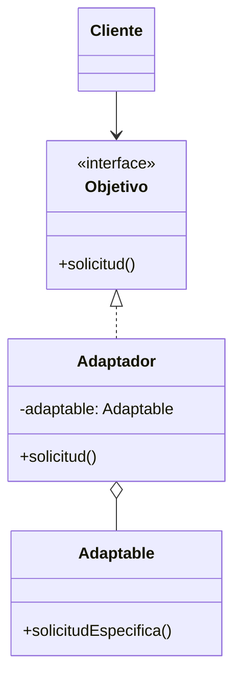
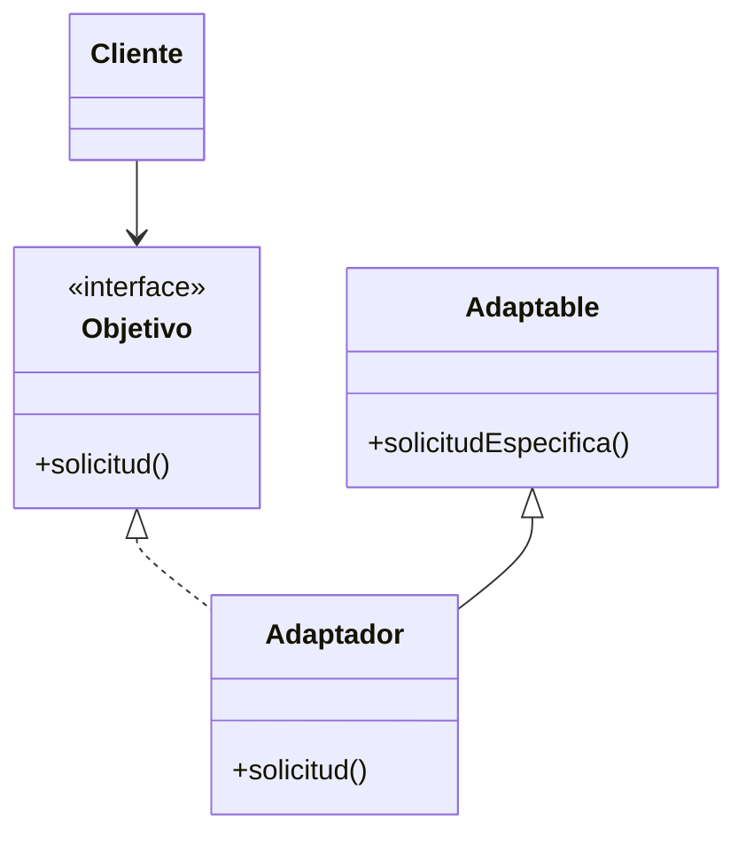

# Patrón Adapter (Adaptador)

## 📋 Propósito

Convierte la interfaz de una clase en otra interfaz que es la que esperan los clientes. Permite que cooperen clases que de otra forma no podrían por tener interfaces incompatibles.

## 🎯 Problema que Resuelve

Tienes una clase existente con una interfaz útil, pero:
- Su interfaz no coincide con la que necesitas
- No puedes modificar la clase existente (bibliotecas de terceros, código legacy)
- Necesitas reutilizar código existente en un contexto diferente

## 💡 Solución

Crea una clase **Adaptador** que actúa como intermediario entre el cliente y la clase adaptable. El adaptador traduce las llamadas de la interfaz esperada a llamadas de la interfaz existente.

## 🏗️ Estructura

### Adapter de Objetos (Composición)



### Adapter de Clases (Herencia)



## 👥 Participantes

### **Objetivo** (Target)
- Define la interfaz específica del dominio que usa el Cliente
- Es la interfaz que el cliente espera usar

### **Cliente**
- Colabora con objetos que se ajustan a la interfaz Objetivo
- No sabe que está usando un adaptador

### **Adaptable** (Adaptee)
- Define una interfaz existente que necesita ser adaptada
- Es alguna clase útil (normalmente de terceros o legacy)
- El cliente no puede usarla directamente por incompatibilidad de interfaz

### **Adaptador** (Adapter)
- Adapta la interfaz de Adaptable a la interfaz Objetivo
- Puede tener varios niveles de implementación:
  1. **Pasamanos simple**: Solo redirige llamadas
  2. **Transformación**: Convierte datos entre interfaces
  3. **Funcionalidad extra**: Agrega métodos adicionales

## 🔄 Colaboraciones

1. Cliente llama a métodos en Adaptador usando interfaz Objetivo
2. Adaptador traduce la llamada a métodos de Adaptable
3. Adaptable procesa la solicitud
4. Adaptador retorna el resultado (transformándolo si es necesario)

## ✅ Aplicabilidad

Usa Adapter cuando:

- Quieras usar una clase existente pero su interfaz no coincide con la necesaria
- Quieras crear una clase reutilizable que coopere con clases no relacionadas
- *(Adapter de objetos)* Necesites usar varias subclases existentes sin adaptar cada una por herencia

## 💻 Ejemplo en Java

### Adaptador de Sistema de Pagos

```java
// Objetivo - Interfaz esperada por el sistema
public interface ProcesadorPago {
    ResultadoPago procesarPago(double monto, String tarjeta);
    boolean verificarEstado(String transaccionId);
}

// Adaptable - Biblioteca de terceros (PayPal SDK)
public class PayPalAPI {
    public PayPalResponse sendPayment(PayPalRequest request) {
        // Implementación específica de PayPal
        System.out.println("PayPal procesando: $" + request.getAmount());
        return new PayPalResponse("COMPLETED", "TXN-" + System.currentTimeMillis());
    }
    
    public PayPalStatus checkTransaction(String txnId) {
        return new PayPalStatus(true, "VERIFIED");
    }
}

// Adaptador - Convierte PayPal a nuestra interfaz
public class PayPalAdapter implements ProcesadorPago {
    private PayPalAPI payPalAPI;
    
    public PayPalAdapter() {
        this.payPalAPI = new PayPalAPI();
    }
    
    @Override
    public ResultadoPago procesarPago(double monto, String tarjeta) {
        // 1. Convertir nuestros parámetros a formato PayPal
        PayPalRequest request = new PayPalRequest();
        request.setAmount(monto);
        request.setCardNumber(tarjeta);
        request.setCurrency("USD");
        
        // 2. Llamar a PayPal
        PayPalResponse response = payPalAPI.sendPayment(request);
        
        // 3. Convertir respuesta de PayPal a nuestro formato
        return new ResultadoPago(
            response.getStatus().equals("COMPLETED"),
            response.getTransactionId(),
            "Pago procesado vía PayPal"
        );
    }
    
    @Override
    public boolean verificarEstado(String transaccionId) {
        PayPalStatus status = payPalAPI.checkTransaction(transaccionId);
        return status.isVerified();
    }
}

// Otro Adaptable - Stripe SDK
public class StripeAPI {
    public StripeCharge charge(StripeChargeParams params) {
        System.out.println("Stripe procesando: $" + params.amount);
        return new StripeCharge("ch_" + UUID.randomUUID(), "succeeded");
    }
}

// Otro Adaptador - Stripe
public class StripeAdapter implements ProcesadorPago {
    private StripeAPI stripeAPI;
    
    public StripeAdapter() {
        this.stripeAPI = new StripeAPI();
    }
    
    @Override
    public ResultadoPago procesarPago(double monto, String tarjeta) {
        StripeChargeParams params = new StripeChargeParams();
        params.amount = (int) (monto * 100); // Stripe usa centavos
        params.source = tarjeta;
        
        StripeCharge charge = stripeAPI.charge(params);
        
        return new ResultadoPago(
            charge.status.equals("succeeded"),
            charge.id,
            "Pago procesado vía Stripe"
        );
    }
    
    @Override
    public boolean verificarEstado(String transaccionId) {
        // Implementación simplificada
        return true;
    }
}

// Cliente - No sabe qué procesador usa
public class SistemaPagos {
    private ProcesadorPago procesador;
    
    public SistemaPagos(ProcesadorPago procesador) {
        this.procesador = procesador;
    }
    
    public void realizarCompra(double monto, String tarjeta) {
        System.out.println("Procesando compra de $" + monto);
        
        ResultadoPago resultado = procesador.procesarPago(monto, tarjeta);
        
        if (resultado.isExitoso()) {
            System.out.println("✅ Pago exitoso: " + resultado.getMensaje());
            System.out.println("ID Transacción: " + resultado.getTransaccionId());
        } else {
            System.out.println("❌ Pago fallido");
        }
    }
    
    public static void main(String[] args) {
        // Cliente puede cambiar fácilmente entre procesadores
        SistemaPagos sistema1 = new SistemaPagos(new PayPalAdapter());
        sistema1.realizarCompra(150.00, "4532-1111-2222-3333");
        
        System.out.println();
        
        SistemaPagos sistema2 = new SistemaPagos(new StripeAdapter());
        sistema2.realizarCompra(250.00, "5555-4444-3333-2222");
    }
}
```

**Salida:**
```
Procesando compra de $150.0
PayPal procesando: $150.0
✅ Pago exitoso: Pago procesado vía PayPal
ID Transacción: TXN-1704672000123

Procesando compra de $250.0
Stripe procesando: $250.0
✅ Pago exitoso: Pago procesado vía Stripe
ID Transacción: ch_a1b2c3d4-e5f6-7g8h-9i0j-k1l2m3n4o5p6
```

### Adapter para Logging

```java
// Objetivo - Interfaz de logging del sistema
public interface Logger {
    void info(String mensaje);
    void error(String mensaje, Exception e);
    void debug(String mensaje);
}

// Adaptable - Log4j (biblioteca de terceros)
public class Log4jLogger {
    private org.apache.log4j.Logger log4j;
    
    public void logInfo(String msg) {
        log4j.info(msg);
    }
    
    public void logError(String msg, Throwable t) {
        log4j.error(msg, t);
    }
}

// Adaptador
public class Log4jAdapter implements Logger {
    private Log4jLogger log4jLogger;
    
    public Log4jAdapter(Class<?> clase) {
        this.log4jLogger = new Log4jLogger(clase);
    }
    
    @Override
    public void info(String mensaje) {
        log4jLogger.logInfo(mensaje);
    }
    
    @Override
    public void error(String mensaje, Exception e) {
        log4jLogger.logError(mensaje, e);
    }
    
    @Override
    public void debug(String mensaje) {
        // Log4j usa diferentes niveles, adaptamos
        if (isDebugEnabled()) {
            log4jLogger.logInfo("[DEBUG] " + mensaje);
        }
    }
}

// Cliente
public class ServicioNegocio {
    private Logger logger;
    
    public ServicioNegocio(Logger logger) {
        this.logger = logger;
    }
    
    public void procesarOrden(Orden orden) {
        logger.info("Procesando orden: " + orden.getId());
        try {
            // Lógica de negocio
            logger.debug("Validando orden...");
        } catch (Exception e) {
            logger.error("Error procesando orden", e);
        }
    }
}
```

## 🎯 Ejemplo del Mundo Real: Sistema Empresarial

### Adaptador de Base de Datos Legacy a Nueva API

```java
// Objetivo - Nueva interfaz del sistema
public interface RepositorioSucursal {
    Sucursal buscarPorCodigo(String codSucursal);
    List<Sucursal> listarActivas();
    void guardar(Sucursal sucursal);
}

// Adaptable - Código legacy con MyBatis
public class SucursalMyBatisDAO {
    private SqlSession sqlSession;
    
    public Map<String, Object> getSucursalByCod(String cod) {
        // Retorna Map con estructura antigua
        return sqlSession.selectOne("sucursal.getByCod", cod);
    }
    
    public List<Map<String, Object>> getAllActiveSucursales() {
        // Retorna List<Map> en lugar de objetos
        return sqlSession.selectList("sucursal.getActive");
    }
    
    public void insertSucursal(Map<String, Object> data) {
        sqlSession.insert("sucursal.insert", data);
    }
}

// Adaptador - Convierte legacy a nueva interfaz
public class SucursalLegacyAdapter implements RepositorioSucursal {
    private SucursalMyBatisDAO legacyDAO;
    
    public SucursalLegacyAdapter(SucursalMyBatisDAO legacyDAO) {
        this.legacyDAO = legacyDAO;
    }
    
    @Override
    public Sucursal buscarPorCodigo(String codSucursal) {
        // Convertir Map a objeto Sucursal
        Map<String, Object> data = legacyDAO.getSucursalByCod(codSucursal);
        
        if (data == null) return null;
        
        return new Sucursal(
            (String) data.get("cod_sucursal"),
            (String) data.get("nombre_sucursal"),
            (String) data.get("cod_marca"),
            (Integer) data.get("ms_codcli")
        );
    }
    
    @Override
    public List<Sucursal> listarActivas() {
        List<Map<String, Object>> dataList = legacyDAO.getAllActiveSucursales();
        
        return dataList.stream()
            .map(data -> new Sucursal(
                (String) data.get("cod_sucursal"),
                (String) data.get("nombre_sucursal"),
                (String) data.get("cod_marca"),
                (Integer) data.get("ms_codcli")
            ))
            .collect(Collectors.toList());
    }
    
    @Override
    public void guardar(Sucursal sucursal) {
        // Convertir objeto Sucursal a Map
        Map<String, Object> data = new HashMap<>();
        data.put("cod_sucursal", sucursal.getCodigoSucursal());
        data.put("nombre_sucursal", sucursal.getNombre());
        data.put("cod_marca", sucursal.getCodigoMarca());
        data.put("ms_codcli", sucursal.getMsCodeli());
        
        legacyDAO.insertSucursal(data);
    }
}

// Cliente - Usa nueva interfaz limpia
@Service
public class SucursalService {
    private RepositorioSucursal repositorio;
    
    @Autowired
    public SucursalService(RepositorioSucursal repositorio) {
        this.repositorio = repositorio;
    }
    
    public void crearSucursal(SucursalDTO dto) {
        Sucursal sucursal = new Sucursal(
            dto.getCodigo(),
            dto.getNombre(),
            dto.getMarca(),
            dto.getCliente()
        );
        
        repositorio.guardar(sucursal);
    }
    
    public List<Sucursal> obtenerSucursalesActivas() {
        return repositorio.listarActivas();
    }
}

// Configuración Spring
@Configuration
public class DatabaseConfig {
    @Bean
    public RepositorioSucursal repositorioSucursal(SqlSession sqlSession) {
        SucursalMyBatisDAO legacyDAO = new SucursalMyBatisDAO(sqlSession);
        return new SucursalLegacyAdapter(legacyDAO);
    }
}
```

### Adapter Multi-nivel

```java
// Adaptador con transformación compleja
public class TerminalAPIAdapter implements TerminalRepository {
    private LegacyTerminalService legacyService;
    private AplicacionService aplicacionService;
    
    @Override
    public Terminal buscarPorCodigo(String codTerminal) {
        // 1. Llamar al servicio legacy
        LegacyTerminalDTO legacyDTO = legacyService.getTerminal(codTerminal);
        
        // 2. Transformar y enriquecer datos
        Terminal terminal = convertirDTO(legacyDTO);
        
        // 3. Agregar funcionalidad adicional (no solo pasamanos)
        if (terminal.getAplicacionCodigo() != null) {
            Aplicacion app = aplicacionService.buscarPorCodigo(
                terminal.getAplicacionCodigo()
            );
            terminal.setNombreAplicacion(app.getNombre());
        }
        
        return terminal;
    }
    
    private Terminal convertirDTO(LegacyTerminalDTO dto) {
        // Lógica de conversión compleja
        Terminal terminal = new Terminal();
        terminal.setCodTerminal(dto.getTerminalCode());
        terminal.setNombreTerminal(dto.getName());
        terminal.setVinculado(dto.isLinked() ? 1 : 0);
        
        // Unificar campos separados en el legacy
        terminal.setUbicacion(
            dto.getAddress() + ", " + dto.getCity() + ", " + dto.getCountry()
        );
        
        return terminal;
    }
}
```

## ⚖️ Ventajas y Desventajas

### ✅ Ventajas

1. **Principio de Responsabilidad Única**: Separa conversión de interfaz de la lógica de negocio
2. **Principio Abierto/Cerrado**: Nuevos adaptadores sin modificar código existente
3. **Reutilización de código legacy**: Integra código antiguo en nuevos sistemas
4. **Desacoplamiento**: Cliente y Adaptable no se conocen directamente

### ❌ Desventajas

1. **Complejidad adicional**: Agrega una capa extra de abstracción
2. **Performance**: Overhead por las conversiones de datos
3. **Mantenimiento**: Cambios en Adaptable pueden requerir actualizar Adaptador

## 🔗 Patrones Relacionados

- **Bridge**: Similar en estructura pero diferente en intención (Bridge separa abstracción de implementación)
- **Decorator**: Agrega responsabilidades, Adapter cambia interfaz
- **Proxy**: Misma interfaz, Adapter cambia la interfaz
- **Facade**: Simplifica interfaz compleja, Adapter convierte interfaz incompatible

## 💡 Consejos de Implementación

1. **Usa Adapter de objetos (composición)** en lugar de herencia cuando sea posible
2. **Mantén el adaptador delgado**: Solo conversión, no lógica de negocio
3. **Documenta las transformaciones** especialmente si son complejas
4. **Considera crear factories** si tienes muchos adaptadores similares

## 📚 Referencias

- Gang of Four - Design Patterns (1994)

---

*Última actualización: 2026-01-07*
