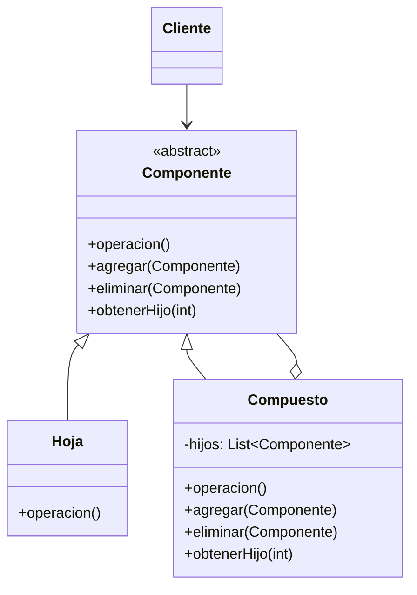

# Patrón Composite (Compuesto)

## 📋 Propósito

Compone objetos en estructuras de árbol para representar jerarquías parte-todo (*part-whole hierarchy*). Permite que los clientes traten de manera uniforme a los objetos individuales y a los compuestos.

## 🎯 Problema que Resuelve

Cuando necesitas trabajar con estructuras de objetos en forma de árbol (como sistemas de archivos, interfaces gráficas, organizaciones empresariales), te enfrentas a:

- **Complejidad en el código cliente**: Los clientes necesitan distinguir entre objetos simples y compuestos
- **Código duplicado**: Operaciones similares para objetos individuales y grupos
- **Difícil mantenimiento**: Agregar nuevos tipos de componentes requiere modificar múltiple código

## 💡 Solución

Define una **clase abstracta Componente** que representa tanto objetos primitivos como sus contenedores. Los clientes interactúan con todos los objetos de la estructura a través de esta interfaz común.

## 🏗️ Estructura



## 👥 Participantes

### **Componente** (abstracto)
- Define la interfaz común para todos los objetos de la composición
- Define la interfaz para acceder y gestionar los hijos
- Implementa comportamiento por defecto común a las subclases
- *(Opcional)* Define interfaz para acceder al padre en la estructura recursiva

### **Hoja**
- Representa objetos simples sin hijos
- Define el comportamiento primitivo
- No puede contener otros componentes

### **Compuesto**
- Define comportamiento para componentes que tienen hijos
- Almacena componentes hijos
- Implementa operaciones relacionadas con la gestión de hijos
- Implementa la operación principal delegando en sus hijos

### **Cliente**
- Manipula objetos de la composición a través de la interfaz Componente

## 🔄 Colaboraciones

1. Cliente usa la interfaz Componente para interactuar con objetos
2. Si el receptor es una **Hoja**, maneja la petición directamente
3. Si es un **Compuesto**, delega las operaciones a sus hijos, posiblemente ejecutando operaciones auxiliares antes/después

## ✅ Aplicabilidad

Usa Composite cuando:

- Quieras representar jerarquías parte-todo de objetos
- Quieras que los clientes ignoren la diferencia entre composiciones y objetos individuales
- Los clientes traten todos los objetos de la estructura de manera uniforme

## 💻 Ejemplo en Java

### Sistema de Archivos

```java
// Componente
public abstract class ComponenteArchivo {
    protected String nombre;
    
    public ComponenteArchivo(String nombre) {
        this.nombre = nombre;
    }
    
    public abstract void mostrar(String indentacion);
    public abstract long obtenerTamanio();
    
    // Operaciones de composición (por defecto no hacen nada)
    public void agregar(ComponenteArchivo componente) {
        throw new UnsupportedOperationException();
    }
    
    public void eliminar(ComponenteArchivo componente) {
        throw new UnsupportedOperationException();
    }
}

// Hoja - Archivo
public class Archivo extends ComponenteArchivo {
    private long tamanio;
    
    public Archivo(String nombre, long tamanio) {
        super(nombre);
        this.tamanio = tamanio;
    }
    
    @Override
    public void mostrar(String indentacion) {
        System.out.println(indentacion + "📄 " + nombre + " (" + tamanio + " KB)");
    }
    
    @Override
    public long obtenerTamanio() {
        return tamanio;
    }
}

// Compuesto - Directorio
public class Directorio extends ComponenteArchivo {
    private List<ComponenteArchivo> hijos = new ArrayList<>();
    
    public Directorio(String nombre) {
        super(nombre);
    }
    
    @Override
    public void agregar(ComponenteArchivo componente) {
        hijos.add(componente);
    }
    
    @Override
    public void eliminar(ComponenteArchivo componente) {
        hijos.remove(componente);
    }
    
    @Override
    public void mostrar(String indentacion) {
        System.out.println(indentacion + "📁 " + nombre + "/");
        for (ComponenteArchivo hijo : hijos) {
            hijo.mostrar(indentacion + "  ");
        }
    }
    
    @Override
    public long obtenerTamanio() {
        long tamanioTotal = 0;
        for (ComponenteArchivo hijo : hijos) {
            tamanioTotal += hijo.obtenerTamanio();
        }
        return tamanioTotal;
    }
}

// Cliente
public class SistemaArchivos {
    public static void main(String[] args) {
        // Crear estructura de directorios
        Directorio raiz = new Directorio("proyecto");
        
        Directorio src = new Directorio("src");
        src.agregar(new Archivo("Main.java", 15));
        src.agregar(new Archivo("Utils.java", 8));
        
        Directorio docs = new Directorio("docs");
        docs.agregar(new Archivo("README.md", 5));
        docs.agregar(new Archivo("ARCHITECTURE.md", 12));
        
        raiz.agregar(src);
        raiz.agregar(docs);
        raiz.agregar(new Archivo("pom.xml", 3));
        
        // Cliente trabaja uniformemente con todos los componentes
        raiz.mostrar("");
        System.out.println("\nTamaño total: " + raiz.obtenerTamanio() + " KB");
    }
}
```

**Salida:**
```
📁 proyecto/
  📁 src/
    📄 Main.java (15 KB)
    📄 Utils.java (8 KB)
  📁 docs/
    📄 README.md (5 KB)
    📄 ARCHITECTURE.md (12 KB)
  📄 pom.xml (3 KB)

Tamaño total: 43 KB
```

### Ejemplo de Interfaz Gráfica (UI Components)

```java
// Componente
public abstract class ComponenteUI {
    protected String id;
    
    public ComponenteUI(String id) {
        this.id = id;
    }
    
    public abstract void renderizar();
    public abstract void agregar(ComponenteUI componente);
}

// Hoja - Botón
public class Boton extends ComponenteUI {
    private String texto;
    
    public Boton(String id, String texto) {
        super(id);
        this.texto = texto;
    }
    
    @Override
    public void renderizar() {
        System.out.println("<button id='" + id + "'>" + texto + "</button>");
    }
    
    @Override
    public void agregar(ComponenteUI componente) {
        throw new UnsupportedOperationException("Un botón no puede contener hijos");
    }
}

// Compuesto - Panel
public class Panel extends ComponenteUI {
    private List<ComponenteUI> componentes = new ArrayList<>();
    private String clase;
    
    public Panel(String id, String clase) {
        super(id);
        this.clase = clase;
    }
    
    @Override
    public void renderizar() {
        System.out.println("<div id='" + id + "' class='" + clase + "'>");
        for (ComponenteUI componente : componentes) {
            componente.renderizar();
        }
        System.out.println("</div>");
    }
    
    @Override
    public void agregar(ComponenteUI componente) {
        componentes.add(componente);
    }
}

// Uso
Panel formulario = new Panel("form-login", "form-container");
formulario.agregar(new Boton("btn-submit", "Ingresar"));
formulario.agregar(new Boton("btn-cancel", "Cancelar"));

Panel sidebar = new Panel("sidebar", "sidebar-menu");
sidebar.agregar(new Boton("btn-home", "Inicio"));
sidebar.agregar(formulario); // Composición anidada

sidebar.renderizar();
```

## 🎯 Ejemplo del Mundo Real: Sistema Empresarial

### Jerarquía de Agrupadores

```java
// Componente
public abstract class AgrupadorComponente {
    protected String codigo;
    protected String nombre;
    
    public abstract void aplicarConfiguracion(Configuracion config);
    public abstract int contarEntidades();
    public abstract void agregar(AgrupadorComponente componente);
}

// Hoja - Sucursal
public class Sucursal extends AgrupadorComponente {
    private String codSucursal;
    
    @Override
    public void aplicarConfiguracion(Configuracion config) {
        System.out.println("Aplicando config a sucursal: " + nombre);
        // Lógica de aplicación
    }
    
    @Override
    public int contarEntidades() {
        return 1;
    }
    
    @Override
    public void agregar(AgrupadorComponente componente) {
        throw new UnsupportedOperationException();
    }
}

// Compuesto - Grupo de Sucursales
public class GrupoSucursales extends AgrupadorComponente {
    private List<AgrupadorComponente> miembros = new ArrayList<>();
    
    @Override
    public void aplicarConfiguracion(Configuracion config) {
        System.out.println("Aplicando config a grupo: " + nombre);
        for (AgrupadorComponente miembro : miembros) {
            miembro.aplicarConfiguracion(config);
        }
    }
    
    @Override
    public int contarEntidades() {
        return miembros.stream()
            .mapToInt(AgrupadorComponente::contarEntidades)
            .sum();
    }
    
    @Override
    public void agregar(AgrupadorComponente componente) {
        miembros.add(componente);
    }
}

// Uso: Operación masiva en agrupadores
GrupoSucursales zona1 = new GrupoSucursales("ZONA-1", "Zona Centro");
zona1.agregar(new Sucursal("SUC-001", "Centro Principal"));
zona1.agregar(new Sucursal("SUC-002", "Centro Anexo"));

GrupoSucursales todasLasZonas = new GrupoSucursales("ALL", "Todas las Zonas");
todasLasZonas.agregar(zona1);
todasLasZonas.agregar(new Sucursal("SUC-100", "Sucursal Independiente"));

// Cliente trata todo uniformemente
Configuracion nuevaConfig = new Configuracion("descuento_navidad", 15);
todasLasZonas.aplicarConfiguracion(nuevaConfig);

System.out.println("Total sucursales: " + todasLasZonas.contarEntidades());
```

## ⚖️ Ventajas y Desventajas

### ✅ Ventajas

1. **Simplifica el código cliente**: Trata objetos simples y compuestos uniformemente
2. **Facilita agregar nuevos componentes**: Nuevas Hojas o Compuestos sin cambiar código existente
3. **Diseño más flexible**: Jerarquías pueden crearse dinámicamente
4. **Operaciones recursivas naturales**: Ideal para estructuras de árbol

### ❌ Desventajas

1. **Diseño muy general**: Puede ser difícil restringir componentes válidos
2. **Seguridad de tipos**: No se puede usar el sistema de tipos para asegurar que Hojas no tengan hijos
3. **Overhead en objetos simples**: Las Hojas deben implementar métodos de gestión aunque no los usen

## 🔗 Patrones Relacionados

- **Decorator**: Similar en estructura, pero Decorator agrega responsabilidades, Composite agrega componentes
- **Iterator**: Útil para recorrer estructuras Composite
- **Visitor**: Puede aplicar operaciones sobre estructuras Composite sin cambiar las clases
- **Chain of Responsibility**: A menudo se usa con Composite

## 📚 Referencias

- Gang of Four - Design Patterns (1994)

---

*Última actualización: 2026-01-07*
