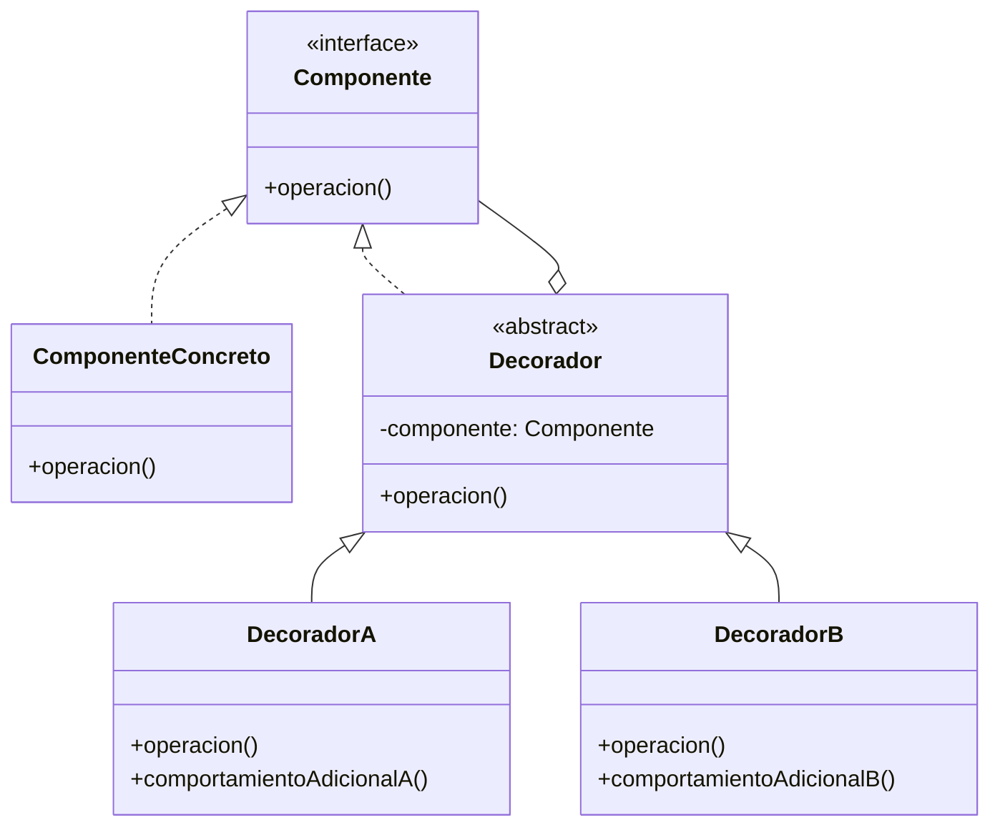

# Patrón Decorator (Decorador)

## 📋 Propósito

Asigna responsabilidades adicionales a un objeto dinámicamente, proporcionando una alternativa flexible a la herencia para extender funcionalidad.

## 🎯 Problema que Resuelve

Cuando necesitas agregar funcionalidad a objetos individuales sin afectar a otros objetos de la misma clase, y sin crear una explosión de subclases para cada combinación posible de características.

**Problemas con herencia tradicional:**
- Muchas subclases para cada combinación (ej: CaféConLeche, CaféConLecheYAzúcar, etc.)
- Cambios difíciles de mantener
- No se puede agregar/quitar responsabilidades en tiempo de ejecución

## 💡 Solución

Encapsula el objeto original dentro de una serie de "decoradores". Cada decorador:
- Implementa la misma interfaz que el objeto decorado
- Delega trabajo al objeto encapsulado
- Puede ejecutar algo antes/después de la delegación

## 🏗️ Estructura



## 👥 Participantes

### **Componente** (interface)
- Define la interfaz para objetos a los que se pueden añadir responsabilidades dinámicamente

### **ComponenteConcreto**
- Define un objeto al que se pueden añadir responsabilidades adicionales
- Implementación base de la funcionalidad

### **Decorador** (abstract)
- Mantiene una referencia a un objeto Componente
- Define una interfaz que se ajusta a la interfaz del Componente
- Delega todas las operaciones al componente encapsulado

### **DecoradorConcreto**
- Añade responsabilidades al componente
- Puede ejecutar lógica antes/después de delegar al componente

## 🔄 Colaboraciones

1. Decorador reenvía peticiones a su objeto Componente
2. Puede realizar operaciones adicionales antes o después del reenvío
3. Los decoradores pueden anidarse recursivamente

## ✅ Aplicabilidad

Usa Decorator cuando:

- Quieras añadir responsabilidades a objetos individuales dinámicamente y transparentemente
- Las responsabilidades puedan ser retiradas
- La extensión por herencia no sea práctica (explosión de subclases)
- Necesites combinar varias funcionalidades de forma flexible

## 💻 Ejemplo en Java

### Sistema de Notificaciones

```java
// Componente
public interface Notificador {
    void enviar(String mensaje);
}

// Componente Concreto
public class NotificadorBase implements Notificador {
    @Override
    public void enviar(String mensaje) {
        System.out.println("📧 Enviando notificación base: " + mensaje);
    }
}

// Decorador abstracto
public abstract class NotificadorDecorador implements Notificador {
    protected Notificador notificadorEncapsulado;
    
    public NotificadorDecorador(Notificador notificador) {
        this.notificadorEncapsulado = notificador;
    }
    
    @Override
    public void enviar(String mensaje) {
        notificadorEncapsulado.enviar(mensaje);
    }
}

// Decorador Concreto - Email
public class EmailDecorador extends NotificadorDecorador {
    private String email;
    
    public EmailDecorador(Notificador notificador, String email) {
        super(notificador);
        this.email = email;
    }
    
    @Override
    public void enviar(String mensaje) {
        super.enviar(mensaje);
        enviarEmail(mensaje);
    }
    
    private void enviarEmail(String mensaje) {
        System.out.println("✉️  Email enviado a " + email + ": " + mensaje);
    }
}

// Decorador Concreto - SMS
public class SMSDecorador extends NotificadorDecorador {
    private String telefono;
    
    public SMSDecorador(Notificador notificador, String telefono) {
        super(notificador);
        this.telefono = telefono;
    }
    
    @Override
    public void enviar(String mensaje) {
        super.enviar(mensaje);
        enviarSMS(mensaje);
    }
    
    private void enviarSMS(String mensaje) {
        System.out.println("📱 SMS enviado a " + telefono + ": " + mensaje);
    }
}

// Decorador Concreto - Slack
public class SlackDecorador extends NotificadorDecorador {
    private String canal;
    
    public SlackDecorador(Notificador notificador, String canal) {
        super(notificador);
        this.canal = canal;
    }
    
    @Override
    public void enviar(String mensaje) {
        super.enviar(mensaje);
        enviarSlack(mensaje);
    }
    
    private void enviarSlack(String mensaje) {
        System.out.println("💬 Slack notificado en #" + canal + ": " + mensaje);
    }
}

// Cliente
public class SistemaNotificaciones {
    public static void main(String[] args) {
        // Solo notificación base
        Notificador notificador1 = new NotificadorBase();
        notificador1.enviar("Sistema iniciado");
        
        System.out.println("\n--- Con decoradores ---\n");
        
        // Base + Email
        Notificador notificador2 = new EmailDecorador(
            new NotificadorBase(),
            "admin@empresa.com"
        );
        notificador2.enviar("Error en el sistema");
        
        System.out.println();
        
        // Base + Email + SMS (decoradores anidados)
        Notificador notificador3 = new SMSDecorador(
            new EmailDecorador(
                new NotificadorBase(),
                "admin@empresa.com"
            ),
            "+54911-1234-5678"
        );
        notificador3.enviar("¡Alerta crítica!");
        
        System.out.println();
        
        // Base + Email + SMS + Slack (tres decoradores)
        Notificador notificador4 = new SlackDecorador(
            new SMSDecorador(
                new EmailDecorador(
                    new NotificadorBase(),
                    "admin@empresa.com"
                ),
                "+54911-1234-5678"
            ),
            "alertas-criticas"
        );
        notificador4.enviar("¡Servidor caído!");
    }
}
```

**Salida:**
```
📧 Enviando notificación base: Sistema iniciado

--- Con decoradores ---

📧 Enviando notificación base: Error en el sistema
✉️  Email enviado a admin@empresa.com: Error en el sistema

📧 Enviando notificación base: ¡Alerta crítica!
✉️  Email enviado a admin@empresa.com: ¡Alerta crítica!
📱 SMS enviado a +54911-1234-5678: ¡Alerta crítica!

📧 Enviando notificación base: ¡Servidor caído!
✉️  Email enviado a admin@empresa.com: ¡Servidor caído!
📱 SMS enviado a +54911-1234-5678: ¡Servidor caído!
💬 Slack notificado en #alertas-criticas: ¡Servidor caído!
```

### Ejemplo de Bebidas (Clásico)

```java
// Componente
public interface Bebida {
    String getDescripcion();
    double getCosto();
}

// Componente Concreto
public class Cafe implements Bebida {
    @Override
    public String getDescripcion() {
        return "Café";
    }
    
    @Override
    public double getCosto() {
        return 50.0;
    }
}

public class Te implements Bebida {
    @Override
    public String getDescripcion() {
        return "Té";
    }
    
    @Override
    public double getCosto() {
        return 40.0;
    }
}

// Decorador abstracto
public abstract class BebidaDecorador implements Bebida {
    protected Bebida bebida;
    
    public BebidaDecorador(Bebida bebida) {
        this.bebida = bebida;
    }
    
    @Override
    public String getDescripcion() {
        return bebida.getDescripcion();
    }
    
    @Override
    public double getCosto() {
        return bebida.getCosto();
    }
}

// Decoradores Concretos
public class LecheDecorador extends BebidaDecorador {
    public LecheDecorador(Bebida bebida) {
        super(bebida);
    }
    
    @Override
    public String getDescripcion() {
        return bebida.getDescripcion() + " con Leche";
    }
    
    @Override
    public double getCosto() {
        return bebida.getCosto() + 10.0;
    }
}

public class AzucarDecorador extends BebidaDecorador {
    public AzucarDecorador(Bebida bebida) {
        super(bebida);
    }
    
    @Override
    public String getDescripcion() {
        return bebida.getDescripcion() + " con Azúcar";
    }
    
    @Override
    public double getCosto() {
        return bebida.getCosto() + 5.0;
    }
}

public class CremaDecorador extends BebidaDecorador {
    public CremaDecorador(Bebida bebida) {
        super(bebida);
    }
    
    @Override
    public String getDescripcion() {
        return bebida.getDescripcion() + " con Crema";
    }
    
    @Override
    public double getCosto() {
        return bebida.getCosto() + 15.0;
    }
}

// Cliente
public class Cafeteria {
    public static void imprimirOrden(Bebida bebida) {
        System.out.println(bebida.getDescripcion() + 
                         " = $" + bebida.getCosto());
    }
    
    public static void main(String[] args) {
        // Café simple
        Bebida cafe = new Cafe();
        imprimirOrden(cafe);
        
        // Café con leche
        Bebida cafeConLeche = new LecheDecorador(new Cafe());
        imprimirOrden(cafeConLeche);
        
        // Café con leche y azúcar
        Bebida cafeConLecheYAzucar = new AzucarDecorador(
            new LecheDecorador(new Cafe())
        );
        imprimirOrden(cafeConLecheYAzucar);
        
        // Té con leche, azúcar y crema
        Bebida teCompleto = new CremaDecorador(
            new AzucarDecorador(
                new LecheDecorador(new Te())
            )
        );
        imprimirOrden(teCompleto);
    }
}
```

**Salida:**
```
Café = $50.0
Café con Leche = $60.0
Café con Leche con Azúcar = $65.0
Té con Leche con Azúcar con Crema = $70.0
```

## 🎯 Ejemplo del Mundo Real: Sistema Empresarial

### Decorador de Descuentos

```java
// Componente
public interface PrecioCalculable {
    double calcularPrecio();
    String getDescripcion();
}

// Componente Concreto
public class ProductoBase implements PrecioCalculable {
    private String nombre;
    private double precioBase;
    
    public ProductoBase(String nombre, double precioBase) {
        this.nombre = nombre;
        this.precioBase = precioBase;
    }
    
    @Override
    public double calcularPrecio() {
        return precioBase;
    }
    
    @Override
    public String getDescripcion() {
        return nombre;
    }
}

// Decorador abstracto
public abstract class DescuentoDecorador implements PrecioCalculable {
    protected PrecioCalculable producto;
    
    public DescuentoDecorador(PrecioCalculable producto) {
        this.producto = producto;
    }
    
    @Override
    public double calcularPrecio() {
        return producto.calcularPrecio();
    }
    
    @Override
    public String getDescripcion() {
        return producto.getDescripcion();
    }
}

// Decoradores Concretos
public class DescuentoPorcentajeDecorador extends DescuentoDecorador {
    private double porcentaje;
    private String razon;
    
    public DescuentoPorcentajeDecorador(PrecioCalculable producto, 
                                       double porcentaje, String razon) {
        super(producto);
        this.porcentaje = porcentaje;
        this.razon = razon;
    }
    
    @Override
    public double calcularPrecio() {
        double precioOriginal = producto.calcularPrecio();
        return precioOriginal * (1 - porcentaje / 100);
    }
    
    @Override
    public String getDescripcion() {
        return producto.getDescripcion() + 
               String.format(" [-%d%% %s]", (int)porcentaje, razon);
    }
}

public class DescuentoFijoDecorador extends DescuentoDecorador {
    private double montoDescuento;
    private String razon;
    
    public DescuentoFijoDecorador(PrecioCalculable producto, 
                                 double montoDescuento, String razon) {
        super(producto);
        this.montoDescuento = montoDescuento;
        this.razon = razon;
    }
    
    @Override
    public double calcularPrecio() {
        double precioOriginal = producto.calcularPrecio();
        return Math.max(0, precioOriginal - montoDescuento);
    }
    
    @Override
    public String getDescripcion() {
        return producto.getDescripcion() + 
               String.format(" [-$%.2f %s]", montoDescuento, razon);
    }
}

public class ImpuestoDecorador extends DescuentoDecorador {
    private double porcentajeImpuesto;
    
    public ImpuestoDecorador(PrecioCalculable producto, 
                            double porcentajeImpuesto) {
        super(producto);
        this.porcentajeImpuesto = porcentajeImpuesto;
    }
    
    @Override
    public double calcularPrecio() {
        double precioOriginal = producto.calcularPrecio();
        return precioOriginal * (1 + porcentajeImpuesto / 100);
    }
    
    @Override
    public String getDescripcion() {
        return producto.getDescripcion() + 
               String.format(" [+%.1f%% IVA]", porcentajeImpuesto);
    }
}

// Uso en sistema de ventas
@Service
public class VentaService {
    
    public void procesarVenta(VentaDTO ventaDTO) {
        // Producto base
        PrecioCalculable producto = new ProductoBase(
            "Notebook Lenovo",
            50000.0
        );
        
        // Aplicar descuento de marca (10%)
        if (ventaDTO.tieneMarca()) {
            producto = new DescuentoPorcentajeDecorador(
                producto, 10, "Marca Asociada"
            );
        }
        
        // Aplicar descuento empleado ($2000)
        if (ventaDTO.esEmpleado()) {
            producto = new DescuentoFijoDecorador(
                producto, 2000, "Descuento Empleado"
            );
        }
        
        // Aplicar descuento promoción (15%)
        if (ventaDTO.tieneCodigoPromocional()) {
            producto = new DescuentoPorcentajeDecorador(
                producto, 15, "Promo Cyber Monday"
            );
        }
        
        // Aplicar impuestos (21% IVA)
        producto = new ImpuestoDecorador(producto, 21);
        
        // Imprimir detalle
        System.out.println("Detalle de venta:");
        System.out.println(producto.getDescripcion());
        System.out.println("Precio final: $" + 
                         String.format("%.2f", producto.calcularPrecio()));
    }
}
```

**Salida:**
```
Detalle de venta:
Notebook Lenovo [-10% Marca Asociada] [-$2000.00 Descuento Empleado] 
[-15% Promo Cyber Monday] [+21.0% IVA]
Precio final: $39952.50
```

## ⚖️ Ventajas y Desventajas

### ✅ Ventajas

1. **Más flexible que herencia**: Agregar/quitar responsabilidades en runtime
2. **Evita explosión de subclases**: No necesitas una clase por cada combinación
3. **Principio de Responsabilidad Única**: Divide funcionalidad en clases pequeñas
4. **Principio Abierto/Cerrado**: Extender sin modificar código existente
5. **Composición recursiva**: Puedes anidar decoradores ilimitadamente

### ❌ Desventajas

1. **Complejidad**: Muchas clases pequeñas pueden ser difíciles de entender
2. **Orden importa**: El orden de los decoradores puede afectar el resultado
3. **Identidad de objetos**: El objeto decorado no es idéntico al original
4. **Debugging difícil**: Stack traces largos con muchos decoradores

## 🔗 Patrones Relacionados

- **Adapter**: Cambia interfaz, Decorator agrega responsabilidades
- **Composite**: Estructura similar, pero Composite agrupa, Decorator envuelve
- **Strategy**: Cambia el interior del objeto, Decorator cambia la piel
- **Proxy**: Misma interfaz, pero controla acceso en lugar de agregar funcionalidad

## 💡 Consejos de Implementación

1. **Mantén Componente ligero**: Solo interfaz, no datos pesados
2. **Decoradores transparentes**: Deben poder usarse como el componente original
3. **Considera el orden**: Documenta si el orden de decoradores importa
4. **Builder pattern**: Útil para construir objetos con muchos decoradores

## 📚 Referencias

- Gang of Four - Design Patterns (1994)


---

*Última actualización: 2026-01-07*
