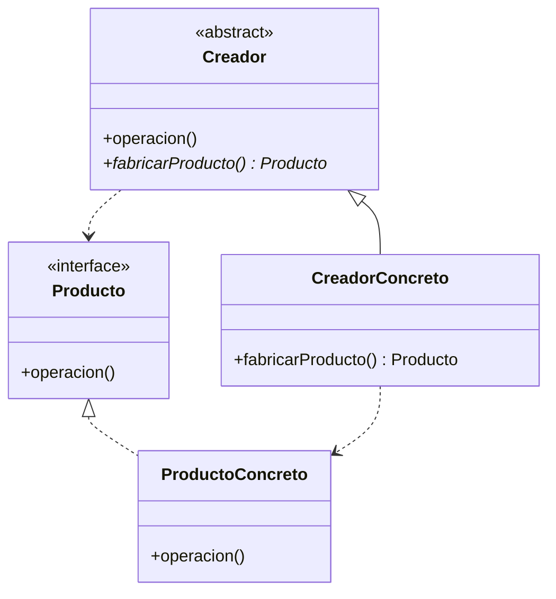

# Patrón Factory Method (Método de Fábrica)

## 📋 Propósito

Define una interfaz para crear un objeto, pero deja que sean las subclases quienes decidan qué clase instanciar. Permite que una clase delegue en sus subclases la creación de objetos.

## 🎯 Problema

Cuando una aplicación necesita crear objetos pero no puede anticipar de antemano la clase exacta que debe instanciar, o cuando quiere delegar la responsabilidad de creación a subclases.

## 💡 Solución

Encapsula el conocimiento sobre qué subclases crear en un método abstracto que las subclases deben implementar.

## 🏗️ Estructura



## 💻 Ejemplo: Sistema de Pagos

```java
// Producto
public interface MedioPago {
    void procesarPago(double monto);
    boolean validar();
}

// Productos Concretos
public class TarjetaCredito implements MedioPago {
    private String numero;
    
    @Override
    public void procesarPago(double monto) {
        System.out.println("💳 Procesando $" + monto + " con tarjeta");
    }
    
    @Override
    public boolean validar() {
        return numero != null && numero.length() == 16;
    }
}

public class MercadoPago implements MedioPago {
    @Override
    public void procesarPago(double monto) {
        System.out.println("🅿️  Procesando $" + monto + " con MercadoPago");
    }
    
    @Override
    public boolean validar() { return true; }
}

// Creador
public abstract class ProcesadorPago {
    public void ejecutarPago(double monto) {
        MedioPago medio = crearMedioPago();
        if (medio.validar()) {
            medio.procesarPago(monto);
        }
    }
    
    protected abstract MedioPago crearMedioPago();
}

// Creadores Concretos
public class ProcesadorTarjeta extends ProcesadorPago {
    @Override
    protected MedioPago crearMedioPago() {
        return new TarjetaCredito();
    }
}

public class ProcesadorMercadoPago extends ProcesadorPago {
    @Override
    protected MedioPago crearMedioPago() {
        return new MercadoPago();
    }
}

// Uso
ProcesadorPago procesador = new ProcesadorTarjeta();
procesador.ejecutarPago(150.0);
```

## 🎯 Ejemplo Empresa: Factory de Reportes

```java
public abstract class ReporteGenerator {
    public void generarReporte(String sucursal, Date fecha) {
        Reporte reporte = crearReporte();
        reporte.cargarDatos(sucursal, fecha);
        reporte.formatear();
        reporte.exportar();
    }
    
    protected abstract Reporte crearReporte();
}

public class ReporteVentasGenerator extends ReporteGenerator {
    @Override
    protected Reporte crearReporte() {
        return new ReporteVentas();
    }
}

public class ReporteInventarioGenerator extends ReporteGenerator {
    @Override
    protected Reporte crearReporte() {
        return new ReporteInventario();
    }
}
```

## ✅ Aplicabilidad

- Una clase no puede anticipar la clase de objetos que debe crear
- Una clase quiere que subclases especifiquen los objetos que crea
- Las clases delegan responsabilidad a una de varias subclases auxiliares

## ⚖️ Ventajas y Desventajas

### ✅ Ventajas
- Desacopla código de clases concretas
- Principio de Responsabilidad Única
- Principio Abierto/Cerrado

### ❌ Desventajas
- Puede complicar el código con muchas subclases

## 📚 Referencias
- Gang of Four - Design Patterns

---
*Última actualización: 2026-01-07*
