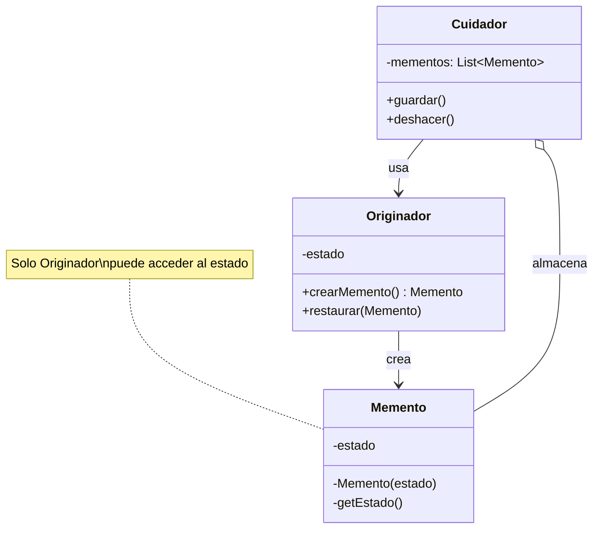

# Patrón Memento (Recuerdo)

## 📋 Propósito

Captura y externaliza el estado interno de un objeto sin violar la encapsulación, de forma que el objeto pueda ser restaurado a este estado más tarde.

## 🎯 Problema que Resuelve

Necesitas guardar y restaurar el estado de un objeto (para implementar undo/redo, snapshots, checkpoints) pero:
- Exponer los detalles internos violaría la encapsulación
- El objeto no quiere que otros accedan directamente a su estado
- Necesitas múltiples puntos de restauración

## 💡 Solución

Delega la creación de snapshots al propio dueño del estado (Originador). El patrón sugiere almacenar la copia del estado en un objeto especial llamado **Memento**, que es opaco para otros objetos excepto el que lo produjo.

## 🏗️ Estructura



## 👥 Participantes

### **Originador (Originator)**
- Crea un memento que contiene una snapshot de su estado actual
- Usa el memento para restaurar su estado interno

### **Memento**
- Almacena el estado interno del Originador
- Protege contra acceso de otros objetos (interfaz restringida)
- Tiene dos interfaces:
  - **Amplia**: Para el Originador (acceso completo)
  - **Reducida**: Para el Cuidador (solo almacenar/pasar)

### **Cuidador (Caretaker)**
- Responsable de guardar el memento en un lugar seguro
- Nunca examina ni opera sobre el contenido del memento
- Gestiona el historial de mementos

## 🔄 Colaboraciones

1. Cuidador solicita memento al Originador
2. Originador crea memento con su estado actual
3. Cuidador almacena el memento
4. Más tarde, Cuidador pasa el memento de vuelta al Originador
5. Originador restaura su estado desde el memento

## ✅ Aplicabilidad

Usa Memento cuando:

- Necesites guardar/restaurar snapshots del estado de un objeto
- Una interfaz directa para obtener el estado violaría la encapsulación
- Quieras implementar operaciones de deshacer (undo)
- Necesites puntos de restauración (checkpoints)

## 💻 Ejemplo en Java

### Editor de Texto con Undo/Redo

```java
// Originador
public class EditorTexto {
    private String contenido;
    private int posicionCursor;
    private String fuente;
    
    public EditorTexto() {
        this.contenido = "";
        this.posicionCursor = 0;
        this.fuente = "Arial";
    }
    
    // Métodos de negocio
    public void escribir(String texto) {
        contenido += texto;
        posicionCursor += texto.length();
        System.out.println("✍️  Escribiendo: " + texto);
    }
    
    public void cambiarFuente(String fuente) {
        this.fuente = fuente;
        System.out.println("🎨 Fuente cambiada a: " + fuente);
    }
    
    public void borrar(int caracteres) {
        if (contenido.length() >= caracteres) {
            contenido = contenido.substring(0, contenido.length() - caracteres);
            posicionCursor -= caracteres;
            System.out.println("🗑️  Borrados " + caracteres + " caracteres");
        }
    }
    
    // Crear snapshot (Memento)
    public MementoEditor guardar() {
        System.out.println("💾 Guardando estado...");
        return new MementoEditor(contenido, posicionCursor, fuente);
    }
    
    // Restaurar desde snapshot
    public void restaurar(MementoEditor memento) {
        this.contenido = memento.getContenido();
        this.posicionCursor = memento.getPosicionCursor();
        this.fuente = memento.getFuente();
        System.out.println("↩️  Estado restaurado");
    }
    
    public void mostrarEstado() {
        System.out.println("\n📄 Estado actual:");
        System.out.println("Contenido: \"" + contenido + "\"");
        System.out.println("Cursor en: " + posicionCursor);
        System.out.println("Fuente: " + fuente);
        System.out.println();
    }
    
    // Memento - Clase interna para encapsulación
    public static class MementoEditor {
        private final String contenido;
        private final int posicionCursor;
        private final String fuente;
        private final long timestamp;
        
        private MementoEditor(String contenido, int posicionCursor, String fuente) {
            this.contenido = contenido;
            this.posicionCursor = posicionCursor;
            this.fuente = fuente;
            this.timestamp = System.currentTimeMillis();
        }
        
        // Solo EditorTexto puede acceder a estos getters
        private String getContenido() { return contenido; }
        private int getPosicionCursor() { return posicionCursor; }
        private String getFuente() { return fuente; }
        
        // Interfaz reducida para Cuidador
        public long getTimestamp() { return timestamp; }
    }
}

// Cuidador
public class HistorialEditor {
    private Stack<EditorTexto.MementoEditor> historial = new Stack<>();
    private Stack<EditorTexto.MementoEditor> redoStack = new Stack<>();
    
    public void guardar(EditorTexto.MementoEditor memento) {
        historial.push(memento);
        redoStack.clear(); // Limpiar redo al hacer cambio nuevo
    }
    
    public EditorTexto.MementoEditor deshacer() {
        if (historial.isEmpty()) {
            System.out.println("⚠️  No hay nada que deshacer");
            return null;
        }
        
        EditorTexto.MementoEditor memento = historial.pop();
        redoStack.push(memento);
        return historial.isEmpty() ? null : historial.peek();
    }
    
    public EditorTexto.MementoEditor rehacer() {
        if (redoStack.isEmpty()) {
            System.out.println("⚠️  No hay nada que rehacer");
            return null;
        }
        
        EditorTexto.MementoEditor memento = redoStack.pop();
        historial.push(memento);
        return memento;
    }
    
    public void mostrarHistorial() {
        System.out.println("\n📚 Historial (" + historial.size() + " estados):");
        for (int i = 0; i < historial.size(); i++) {
            EditorTexto.MementoEditor m = historial.get(i);
            System.out.println("  " + (i+1) + ". Snapshot en " + 
                             new Date(m.getTimestamp()));
        }
        System.out.println();
    }
}

// Cliente
public class AplicacionEditor {
    public static void main(String[] args) throws InterruptedException {
        EditorTexto editor = new EditorTexto();
        HistorialEditor historial = new HistorialEditor();
        
        // Estado inicial
        editor.mostrarEstado();
        historial.guardar(editor.guardar());
        
        Thread.sleep(100);
        
        // Primera edición
        editor.escribir("Hola ");
        historial.guardar(editor.guardar());
        
        Thread.sleep(100);
        
        // Segunda edición
        editor.escribir("Mundo");
        editor.cambiarFuente("Times New Roman");
        historial.guardar(editor.guardar());
        
        editor.mostrarEstado();
        
        // Deshacer última acción
        System.out.println("🔙 DESHACER:");
        EditorTexto.MementoEditor memento = historial.deshacer();
        if (memento != null) {
            editor.restaurar(memento);
        }
        editor.mostrarEstado();
        
        // Deshacer otra vez
        System.out.println("🔙 DESHACER:");
        memento = historial.deshacer();
        if (memento != null) {
            editor.restaurar(memento);
        }
        editor.mostrarEstado();
        
        // Rehacer
        System.out.println("🔜 REHACER:");
        memento = historial.rehacer();
        if (memento != null) {
            editor.restaurar(memento);
        }
        editor.mostrarEstado();
        
        historial.mostrarHistorial();
    }
}
```

**Salida:**
```
📄 Estado actual:
Contenido: ""
Cursor en: 0
Fuente: Arial

💾 Guardando estado...
✍️  Escribiendo: Hola 
💾 Guardando estado...
✍️  Escribiendo: Mundo
🎨 Fuente cambiada a: Times New Roman
💾 Guardando estado...

📄 Estado actual:
Contenido: "Hola Mundo"
Cursor en: 10
Fuente: Times New Roman

🔙 DESHACER:
↩️  Estado restaurado

📄 Estado actual:
Contenido: "Hola "
Cursor en: 5
Fuente: Arial

🔙 DESHACER:
↩️  Estado restaurado

📄 Estado actual:
Contenido: ""
Cursor en: 0
Fuente: Arial

🔜 REHACER:
↩️  Estado restaurado

📄 Estado actual:
Contenido: "Hola "
Cursor en: 5
Fuente: Arial

📚 Historial (2 estados):
  1. Snapshot en Tue Jan 07 15:30:00 ART 2026
  2. Snapshot en Tue Jan 07 15:30:01 ART 2026
```

### Ejemplo de Juego con Checkpoints

```java
// Originador
public class JuegoRPG {
    private int nivel;
    private int vida;
    private int oro;
    private List<String> inventario;
    private String ubicacion;
    
    public JuegoRPG() {
        this.nivel = 1;
        this.vida = 100;
        this.oro = 0;
        this.inventario = new ArrayList<>();
        this.ubicacion = "Villa Inicial";
    }
    
    public void subirNivel() {
        nivel++;
        vida = 100;
        System.out.println("🎉 ¡Subiste al nivel " + nivel + "!");
    }
    
    public void recibirDanio(int cantidad) {
        vida -= cantidad;
        System.out.println("💔 Recibiste " + cantidad + " de daño. Vida: " + vida);
    }
    
    public void recogerOro(int cantidad) {
        oro += cantidad;
        System.out.println("💰 Recogiste " + cantidad + " de oro. Total: " + oro);
    }
    
    public void agregarItem(String item) {
        inventario.add(item);
        System.out.println("🎒 Agregaste " + item + " al inventario");
    }
    
    public void cambiarUbicacion(String nuevaUbicacion) {
        this.ubicacion = nuevaUbicacion;
        System.out.println("🗺️  Llegaste a: " + ubicacion);
    }
    
    // Crear checkpoint
    public Checkpoint crearCheckpoint(String nombre) {
        System.out.println("💾 Guardando checkpoint: " + nombre);
        return new Checkpoint(
            nombre, nivel, vida, oro, 
            new ArrayList<>(inventario), ubicacion
        );
    }
    
    // Restaurar checkpoint
    public void cargarCheckpoint(Checkpoint checkpoint) {
        this.nivel = checkpoint.nivel;
        this.vida = checkpoint.vida;
        this.oro = checkpoint.oro;
        this.inventario = new ArrayList<>(checkpoint.inventario);
        this.ubicacion = checkpoint.ubicacion;
        System.out.println("↩️  Checkpoint cargado: " + checkpoint.nombre);
    }
    
    public void mostrarEstado() {
        System.out.println("\n🎮 Estado del Jugador:");
        System.out.println("Nivel: " + nivel);
        System.out.println("Vida: " + vida);
        System.out.println("Oro: " + oro);
        System.out.println("Inventario: " + inventario);
        System.out.println("Ubicación: " + ubicacion);
        System.out.println();
    }
    
    // Memento
    public static class Checkpoint {
        private final String nombre;
        private final int nivel;
        private final int vida;
        private final int oro;
        private final List<String> inventario;
        private final String ubicacion;
        
        private Checkpoint(String nombre, int nivel, int vida, int oro,
                          List<String> inventario, String ubicacion) {
            this.nombre = nombre;
            this.nivel = nivel;
            this.vida = vida;
            this.oro = oro;
            this.inventario = inventario;
            this.ubicacion = ubicacion;
        }
        
        public String getNombre() { return nombre; }
    }
}

// Cuidador
public class GestorPartidas {
    private Map<String, JuegoRPG.Checkpoint> checkpoints = new HashMap<>();
    
    public void guardarCheckpoint(String id, JuegoRPG.Checkpoint checkpoint) {
        checkpoints.put(id, checkpoint);
    }
    
    public JuegoRPG.Checkpoint cargarCheckpoint(String id) {
        return checkpoints.get(id);
    }
    
    public void listarCheckpoints() {
        System.out.println("\n💾 Checkpoints guardados:");
        checkpoints.forEach((id, cp) -> 
            System.out.println("  " + id + ": " + cp.getNombre())
        );
        System.out.println();
    }
}

// Cliente
public class SistemaJuego {
    public static void main(String[] args) {
        JuegoRPG juego = new JuegoRPG();
        GestorPartidas gestor = new GestorPartidas();
        
        juego.mostrarEstado();
        
        // Progreso inicial
        juego.recogerOro(50);
        juego.agregarItem("Espada de Hierro");
        juego.cambiarUbicacion("Bosque Oscuro");
        
        // Checkpoint 1
        gestor.guardarCheckpoint("checkpoint1", 
                                juego.crearCheckpoint("Entrada al Bosque"));
        
        // Continuar jugando
        juego.subirNivel();
        juego.recogerOro(100);
        juego.agregarItem("Poción de Vida");
        juego.cambiarUbicacion("Cueva del Dragón");
        
        // Checkpoint 2
        gestor.guardarCheckpoint("checkpoint2", 
                                juego.crearCheckpoint("Antes del Jefe Final"));
        
        juego.mostrarEstado();
        
        // Pelea contra jefe (mal resultado)
        juego.recibirDanio(90);
        juego.mostrarEstado();
        
        // Cargar checkpoint anterior
        System.out.println("\n🔄 Cargando checkpoint anterior...");
        JuegoRPG.Checkpoint cp = gestor.cargarCheckpoint("checkpoint2");
        juego.cargarCheckpoint(cp);
        juego.mostrarEstado();
        
        gestor.listarCheckpoints();
    }
}
```

## 🎯 Ejemplo del Mundo Real: Sistema Empresarial

### Memento para Transacciones

```java
// Originador
public class Transaccion {
    private String id;
    private double montoTotal;
    private List<ItemVenta> items;
    private EstadoTransaccion estado;
    private String terminal;
    
    public MementoTransaccion guardarEstado() {
        return new MementoTransaccion(
            montoTotal,
            new ArrayList<>(items),
            estado,
            terminal
        );
    }
    
    public void restaurarEstado(MementoTransaccion memento) {
        this.montoTotal = memento.getMontoTotal();
        this.items = new ArrayList<>(memento.getItems());
        this.estado = memento.getEstado();
        this.terminal = memento.getTerminal();
    }
    
    // Memento - Clase interna estática
    public static class MementoTransaccion {
        private final double montoTotal;
        private final List<ItemVenta> items;
        private final EstadoTransaccion estado;
        private final String terminal;
        
        private MementoTransaccion(double montoTotal, List<ItemVenta> items,
                                  EstadoTransaccion estado, String terminal) {
            this.montoTotal = montoTotal;
            this.items = items;
            this.estado = estado;
            this.terminal = terminal;
        }
        
        private double getMontoTotal() { return montoTotal; }
        private List<ItemVenta> getItems() { return items; }
        private EstadoTransaccion getEstado() { return estado; }
        private String getTerminal() { return terminal; }
    }
}

// Cuidador
@Service
public class GestorTransacciones {
    private Map<String, Stack<Transaccion.MementoTransaccion>> historiales = new ConcurrentHashMap<>();
    
    public void guardarSnapshot(String transaccionId, Transaccion.MementoTransaccion memento) {
        historiales.computeIfAbsent(transaccionId, k -> new Stack<>()).push(memento);
    }
    
    public Transaccion.MementoTransaccion deshacerCambio(String transaccionId) {
        Stack<Transaccion.MementoTransaccion> historial = historiales.get(transaccionId);
        if (historial != null && !historial.isEmpty()) {
            historial.pop(); // Remover estado actual
            return historial.isEmpty() ? null : historial.peek();
        }
        return null;
    }
}
```

## ⚖️ Ventajas y Desventajas

### ✅ Ventajas

1. **Preserva encapsulación**: Estado interno no se expone
2. **Simplifica Originador**: No necesita gestionar versiones de su estado
3. **Undo/Redo fácil**: Implementación natural de deshacer
4. **Snapshots**: Puntos de restauración automáticos

### ❌ Desventajas

1. **Uso de memoria**: Muchos mementos consumen memoria
2. **Costo de creación**: Copiar estado puede ser costoso
3. **Ciclo de vida**: Cuidador debe saber cuándo eliminar mementos viejos
4. **Complejidad**: Dos interfaces (amplia/reducida) puede ser confuso

## 🔗 Patrones Relacionados

- **Command**: Puede usar Memento para undo/redo
- **Iterator**: Memento puede capturar estado de iteración
- **Prototype**: Similar en copiar estado, pero Prototype clona objetos completos

## 💡 Consejos de Implementación

1. **Clase interna**: Declara Memento como clase interna del Originador en Java
2. **Inmutabilidad**: Haz Memento inmutable (campos final)
3. **Limitar historial**: Implementa límite de mementos o TTL
4. **Serialización**: Para persistencia, considera serializar mementos

## 📚 Referencias

- Gang of Four - Design Patterns (1994)

---

*Última actualización: 2026-01-07*
