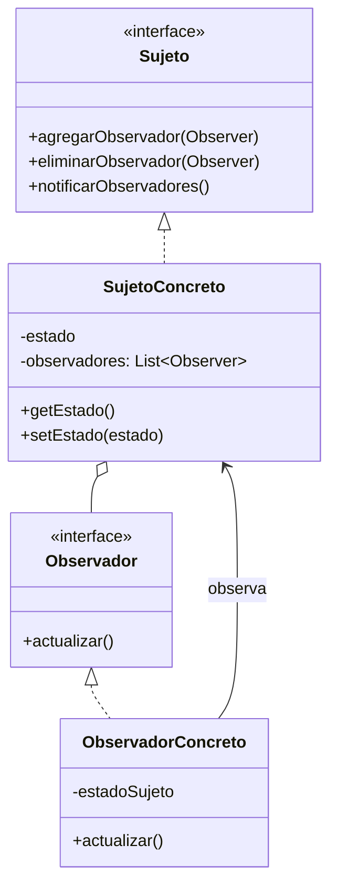

# Patrón Observer (Observador)

## 📋 Propósito

Define una dependencia de uno a muchos entre objetos, de forma que cuando el objeto cambie de estado se notifique y se actualicen automáticamente todos los objetos que dependen de él.

También conocido como: **Publish-Subscribe**, **Event-Subscriber**, **Listener**

## 🎯 Problema que Resuelve

Cuando tienes objetos que necesitan estar al tanto de cambios en otro objeto, pero:
- No quieres un acoplamiento fuerte entre ellos
- El número de objetos interesados puede variar dinámicamente
- No sabes de antemano quién necesitará las notificaciones

**Ejemplo:** Un sistema de trading donde múltiples pantallas (gráficos, tablas, alertas) deben actualizarse cuando cambia el precio de una acción.

## 💡 Solución

El objeto que tiene el estado interesante (Sujeto) mantiene una lista de sus dependientes (Observadores) y los notifica automáticamente de cualquier cambio de estado, generalmente llamando a uno de sus métodos.

## 🏗️ Estructura



## 👥 Participantes

### **Sujeto** (Subject/Observable)
- Conoce a sus observadores
- Proporciona interfaz para agregar/quitar observadores
- Puede ser observado por cualquier número de observadores

### **SujetoConcreto**
- Almacena el estado de interés
- Envía notificación a sus observadores cuando cambia su estado

### **Observador** (Observer)
- Define interfaz de actualización para objetos que deben ser notificados

### **ObservadorConcreto**
- Mantiene referencia al SujetoConcreto
- Almacena estado consistente con el sujeto
- Implementa interfaz de actualización

## 🔄 Colaboraciones

1. SujetoConcreto notifica a sus observadores cuando ocurre un cambio
2. Después de ser notificado, ObservadorConcreto puede consultar al Sujeto para obtener información
3. ObservadorConcreto usa esa información para reconciliar su estado con el del Sujeto

## ✅ Aplicabilidad

Usa Observer cuando:

- Un cambio en un objeto requiere cambiar otros, y no sabes cuántos
- Un objeto debe notificar a otros sin asumir quiénes son (bajo acoplamiento)
- Quieres que los objetos puedan suscribirse/desuscribirse dinámicamente
- Implementas un sistema de eventos

## 💻 Ejemplo en Java

### Sistema de Noticias

```java
// Observador
public interface Observer {
    void actualizar(String noticia);
}

// Sujeto
public interface Subject {
    void agregarObservador(Observer observer);
    void eliminarObservador(Observer observer);
    void notificarObservadores();
}

// Sujeto Concreto
public class AgenciaNoticias implements Subject {
    private List<Observer> observadores = new ArrayList<>();
    private String ultimaNoticia;
    
    @Override
    public void agregarObservador(Observer observer) {
        observadores.add(observer);
        System.out.println("📢 Nuevo suscriptor agregado. Total: " + observadores.size());
    }
    
    @Override
    public void eliminarObservador(Observer observer) {
        observadores.remove(observer);
        System.out.println("📢 Suscriptor eliminado. Total: " + observadores.size());
    }
    
    @Override
    public void notificarObservadores() {
        System.out.println("\n🔔 Notificando a " + observadores.size() + " suscriptores...");
        for (Observer observer : observadores) {
            observer.actualizar(ultimaNoticia);
        }
    }
    
    public void publicarNoticia(String noticia) {
        System.out.println("\n📰 Nueva noticia publicada: " + noticia);
        this.ultimaNoticia = noticia;
        notificarObservadores();
    }
    
    public String getUltimaNoticia() {
        return ultimaNoticia;
    }
}

// Observadores Concretos
public class CanalTV implements Observer {
    private String nombre;
    
    public CanalTV(String nombre) {
        this.nombre = nombre;
    }
    
    @Override
    public void actualizar(String noticia) {
        System.out.println("📺 [" + nombre + "] Transmitiendo: " + noticia);
    }
}

public class SitioWeb implements Observer {
    private String url;
    
    public SitioWeb(String url) {
        this.url = url;
    }
    
    @Override
    public void actualizar(String noticia) {
        System.out.println("🌐 [" + url + "] Publicando en web: " + noticia);
    }
}

public class AplicacionMovil implements Observer {
    private String nombreApp;
    
    public AplicacionMovil(String nombreApp) {
        this.nombreApp = nombreApp;
    }
    
    @Override
    public void actualizar(String noticia) {
        System.out.println("📱 [" + nombreApp + "] Notificación push: " + noticia);
    }
}

// Cliente
public class SistemaNoticias {
    public static void main(String[] args) {
        AgenciaNoticias agencia = new AgenciaNoticias();
        
        // Crear observadores
        Observer canalTN = new CanalTV("TN");
        Observer canalC5N = new CanalTV("C5N");
        Observer sitio = new SitioWeb("www.noticias.com");
        Observer app = new AplicacionMovil("Noticias App");
        
        // Suscribir observadores
        agencia.agregarObservador(canalTN);
        agencia.agregarObservador(sitio);
        agencia.agregarObservador(app);
        
        // Publicar noticia
        agencia.publicarNoticia("¡Argentina campeón del mundo!");
        
        // Agregar otro observador
        agencia.agregarObservador(canalC5N);
        
        // Publicar otra noticia
        agencia.publicarNoticia("Actualización económica del día");
        
        // Desuscribir observador
        agencia.eliminarObservador(sitio);
        
        // Publicar tercera noticia
        agencia.publicarNoticia("Pronóstico del tiempo para mañana");
    }
}
```

**Salida:**
```
📢 Nuevo suscriptor agregado. Total: 1
📢 Nuevo suscriptor agregado. Total: 2
📢 Nuevo suscriptor agregado. Total: 3

📰 Nueva noticia publicada: ¡Argentina campeón del mundo!

🔔 Notificando a 3 suscriptores...
📺 [TN] Transmitiendo: ¡Argentina campeón del mundo!
🌐 [www.noticias.com] Publicando en web: ¡Argentina campeón del mundo!
📱 [Noticias App] Notificación push: ¡Argentina campeón del mundo!

📢 Nuevo suscriptor agregado. Total: 4

📰 Nueva noticia publicada: Actualización económica del día

🔔 Notificando a 4 suscriptores...
📺 [TN] Transmitiendo: Actualización económica del día
🌐 [www.noticias.com] Publicando en web: Actualización económica del día
📱 [Noticias App] Notificación push: Actualización económica del día
📺 [C5N] Transmitiendo: Actualización económica del día

📢 Suscriptor eliminado. Total: 3

📰 Nueva noticia publicada: Pronóstico del tiempo para mañana

🔔 Notificando a 3 suscriptores...
📺 [TN] Transmitiendo: Pronóstico del tiempo para mañana
📱 [Noticias App] Notificación push: Pronóstico del tiempo para mañana
📺 [C5N] Transmitiendo: Pronóstico del tiempo para mañana
```

### Sistema de Monitoreo de Temperatura

```java
// Sujeto
public class SensorTemperatura implements Subject {
    private List<Observer> observadores = new ArrayList<>();
    private double temperatura;
    private String ubicacion;
    
    public SensorTemperatura(String ubicacion) {
        this.ubicacion = ubicacion;
    }
    
    @Override
    public void agregarObservador(Observer observer) {
        observadores.add(observer);
    }
    
    @Override
    public void eliminarObservador(Observer observer) {
        observadores.remove(observer);
    }
    
    @Override
    public void notificarObservadores() {
        for (Observer observer : observadores) {
            observer.actualizar(temperatura, ubicacion);
        }
    }
    
    public void setTemperatura(double temperatura) {
        System.out.println("\n🌡️  Sensor " + ubicacion + " detectó: " + temperatura + "°C");
        this.temperatura = temperatura;
        notificarObservadores();
    }
    
    public double getTemperatura() {
        return temperatura;
    }
}

// Observador genérico
public interface ObserverTemperatura extends Observer {
    void actualizar(double temperatura, String ubicacion);
}

// Observadores Concretos
public class DisplayTemperatura implements ObserverTemperatura {
    @Override
    public void actualizar(double temperatura, String ubicacion) {
        System.out.println("📟 Display [" + ubicacion + "]: " + temperatura + "°C");
    }
}

public class SistemaAlerta implements ObserverTemperatura {
    private double umbralAlto;
    private double umbralBajo;
    
    public SistemaAlerta(double umbralBajo, double umbralAlto) {
        this.umbralBajo = umbralBajo;
        this.umbralAlto = umbralAlto;
    }
    
    @Override
    public void actualizar(double temperatura, String ubicacion) {
        if (temperatura > umbralAlto) {
            System.out.println("🚨 ALERTA [" + ubicacion + "]: Temperatura muy alta! " + temperatura + "°C");
        } else if (temperatura < umbralBajo) {
            System.out.println("❄️  ALERTA [" + ubicacion + "]: Temperatura muy baja! " + temperatura + "°C");
        }
    }
}

public class RegistroHistorico implements ObserverTemperatura {
    private List<String> historial = new ArrayList<>();
    
    @Override
    public void actualizar(double temperatura, String ubicacion) {
        String registro = LocalDateTime.now() + " - " + ubicacion + ": " + temperatura + "°C";
        historial.add(registro);
        System.out.println("📝 Registrado en histórico");
    }
    
    public void mostrarHistorial() {
        System.out.println("\n📊 Historial de temperaturas:");
        historial.forEach(System.out::println);
    }
}

// Uso
public class MonitoreoTemperatura {
    public static void main(String[] args) {
        SensorTemperatura sensorOficina = new SensorTemperatura("Oficina");
        
        // Crear observadores
        DisplayTemperatura display = new DisplayTemperatura();
        SistemaAlerta alertas = new SistemaAlerta(10, 30);
        RegistroHistorico registro = new RegistroHistorico();
        
        // Suscribir
        sensorOficina.agregarObservador(display);
        sensorOficina.agregarObservador(alertas);
        sensorOficina.agregarObservador(registro);
        
        // Simular cambios de temperatura
        sensorOficina.setTemperatura(22.5);
        sensorOficina.setTemperatura(35.0);
        sensorOficina.setTemperatura(5.0);
        sensorOficina.setTemperatura(25.0);
        
        // Mostrar historial
        registro.mostrarHistorial();
    }
}
```

## 🎯 Ejemplo del Mundo Real: Sistema Empresarial

### Observer para Eventos de Terminal

```java
// Observador
public interface EventoTerminalListener {
    void onCambioEstado(Terminal terminal, EstadoTerminal estadoAnterior, EstadoTerminal estadoNuevo);
    void onTransaccionCompletada(Terminal terminal, Transaccion transaccion);
}

// Sujeto
@Entity
public class Terminal {
    private String codTerminal;
    private EstadoTerminal estado;
    
    @Transient
    private List<EventoTerminalListener> listeners = new ArrayList<>();
    
    public void agregarListener(EventoTerminalListener listener) {
        listeners.add(listener);
    }
    
    public void eliminarListener(EventoTerminalListener listener) {
        listeners.remove(listener);
    }
    
    private void notificarCambioEstado(EstadoTerminal estadoAnterior) {
        for (EventoTerminalListener listener : listeners) {
            listener.onCambioEstado(this, estadoAnterior, this.estado);
        }
    }
    
    private void notificarTransaccion(Transaccion transaccion) {
        for (EventoTerminalListener listener : listeners) {
            listener.onTransaccionCompletada(this, transaccion);
        }
    }
    
    public void cambiarEstado(EstadoTerminal nuevoEstado) {
        EstadoTerminal estadoAnterior = this.estado;
        this.estado = nuevoEstado;
        notificarCambioEstado(estadoAnterior);
    }
    
    public void procesarTransaccion(Transaccion transaccion) {
        // Lógica de procesamiento
        transaccion.procesar();
        notificarTransaccion(transaccion);
    }
}

// Observadores Concretos
@Component
public class LogEventListener implements EventoTerminalListener {
    private static final Logger log = LoggerFactory.getLogger(LogEventListener.class);
    
    @Override
    public void onCambioEstado(Terminal terminal, EstadoTerminal anterior, EstadoTerminal nuevo) {
        log.info("Terminal {} cambió de estado: {} -> {}", 
                terminal.getCodTerminal(), anterior, nuevo);
    }
    
    @Override
    public void onTransaccionCompletada(Terminal terminal, Transaccion transaccion) {
        log.info("Transacción {} completada en terminal {}", 
                transaccion.getId(), terminal.getCodTerminal());
    }
}

@Component
public class DashboardActualizador implements EventoTerminalListener {
    @Autowired
    private WebSocketService webSocketService;
    
    @Override
    public void onCambioEstado(Terminal terminal, EstadoTerminal anterior, EstadoTerminal nuevo) {
        DashboardUpdate update = new DashboardUpdate(terminal, nuevo);
        webSocketService.enviarActualizacion("/topic/terminals", update);
    }
    
    @Override
    public void onTransaccionCompletada(Terminal terminal, Transaccion transaccion) {
        TransaccionNotification notif = new TransaccionNotification(transaccion);
        webSocketService.enviarActualizacion("/topic/transactions", notif);
    }
}

@Component
public class AuditoriaListener implements EventoTerminalListener {
    @Autowired
    private AuditoriaService auditoriaService;
    
    @Override
    public void onCambioEstado(Terminal terminal, EstadoTerminal anterior, EstadoTerminal nuevo) {
        auditoriaService.registrarCambioEstado(terminal, anterior, nuevo);
    }
    
    @Override
    public void onTransaccionCompletada(Terminal terminal, Transaccion transaccion) {
        auditoriaService.registrarTransaccion(terminal, transaccion);
    }
}

// Configuración Spring
@Configuration
public class TerminalObserverConfig {
    
    @Bean
    public CommandLineRunner setupTerminalObservers(
            TerminalRepository terminalRepo,
            LogEventListener logListener,
            DashboardActualizador dashboardListener,
            AuditoriaListener auditoriaListener) {
        
        return args -> {
            List<Terminal> terminales = terminalRepo.findAll();
            
            for (Terminal terminal : terminales) {
                terminal.agregarListener(logListener);
                terminal.agregarListener(dashboardListener);
                terminal.agregarListener(auditoriaListener);
            }
        };
    }
}
```

### Observer con Spring Events

```java
// Evento (similar a notificación)
public class VentaCompletadaEvent extends ApplicationEvent {
    private Venta venta;
    private String codTerminal;
    
    public VentaCompletadaEvent(Object source, Venta venta, String codTerminal) {
        super(source);
        this.venta = venta;
        this.codTerminal = codTerminal;
    }
    
    // getters
}

// Publicador (Sujeto)
@Service
public class VentaService {
    @Autowired
    private ApplicationEventPublisher eventPublisher;
    
    public void completarVenta(Venta venta, String codTerminal) {
        // Lógica de negocio
        venta.setEstado(EstadoVenta.COMPLETADA);
        ventaRepository.save(venta);
        
        // Publicar evento
        VentaCompletadaEvent event = new VentaCompletadaEvent(this, venta, codTerminal);
        eventPublisher.publishEvent(event);
    }
}

// Listeners (Observadores)
@Component
public class EmailNotificationListener {
    
    @EventListener
    public void handleVentaCompletada(VentaCompletadaEvent event) {
        // Enviar email de confirmación
        emailService.enviarConfirmacionVenta(event.getVenta());
    }
}

@Component
public class InventarioListener {
    
    @EventListener
    @Async
    public void handleVentaCompletada(VentaCompletadaEvent event) {
        // Actualizar inventario
        inventarioService.descontarStock(event.getVenta().getItems());
    }
}

@Component
public class ReporteListener {
    
    @EventListener
    public void handleVentaCompletada(VentaCompletadaEvent event) {
        // Actualizar reportes en tiempo real
        reporteService.actualizarVentasDiarias(event.getCodTerminal());
    }
}
```

## 📊 Modelos: Push vs Pull

### Modelo Push
El Sujeto envía información detallada en la notificación:

```java
public interface Observer {
    void actualizar(String dato1, int dato2, Object dato3);
}

// Ventaja: Observador no necesita consultar
// Desventaja: Sujeto debe conocer qué datos necesitan los observadores
```

### Modelo Pull
El Sujeto envía notificación mínima, observadores consultan:

```java
public interface Observer {
    void actualizar(Subject sujeto);
}

class ObserverConcreto implements Observer {
    public void actualizar(Subject sujeto) {
        // Consultar datos específicos
        String dato = sujeto.getDato();
    }
}

// Ventaja: Más desacoplado, observadores obtienen lo que necesitan
// Desventaja: Más llamadas al sujeto
```

## ⚖️ Ventajas y Desventajas

### ✅ Ventajas

1. **Bajo acoplamiento**: Sujeto y observadores están débilmente acoplados
2. **Principio Abierto/Cerrado**: Agregar observadores sin modificar sujeto
3. **Comunicación dinámica**: Suscripción/desuscripción en runtime
4. **Broadcasting**: Un cambio notifica a múltiples objetos

### ❌ Desventajas

1. **Orden impredecible**: No hay garantía del orden de notificación
2. **Memory leaks**: Observadores no removidos pueden causar fugas
3. **Notificaciones inesperadas**: Actualizaciones pueden ser costosas
4. **Debugging difícil**: Flujo de notificaciones puede ser complejo de seguir

## 🔗 Patrones Relacionados

- **Mediator**: Centraliza comunicación compleja, Observer distribuye comunicación
- **Singleton**: El Sujeto a menudo es un Singleton
- **Command**: Puede usar Observer para notificar completitud

## 💡 Consejos de Implementación

1. **WeakReferences**: Usa referencias débiles para evitar memory leaks
2. **Thread-safety**: Sincroniza listas de observadores en ambientes multi-hilo
3. **Filtrado de eventos**: Permite a observadores filtrar qué eventos reciben
4. **Async**: Considera notificaciones asíncronas para operaciones costosas

## 📚 Referencias

- Gang of Four - Design Patterns (1994)
- Spring Framework Events

---

*Última actualización: 2026-01-07*
