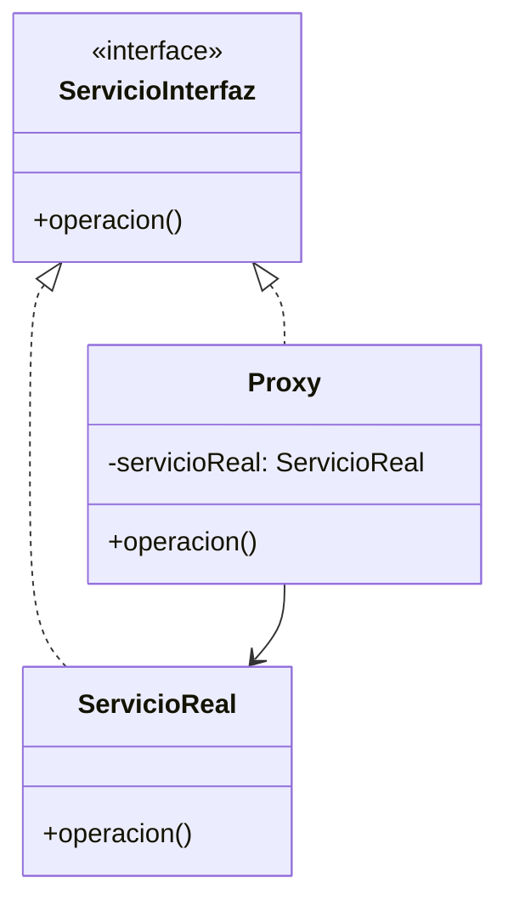

# Patrón Proxy (Representante)

## 📋 Propósito

Proporciona un sustituto o marcador de posición para otro objeto para controlar el acceso a él.

## 🎯 Problema

Necesitas controlar el acceso a un objeto porque:
- Es costoso crear/inicializar
- Requiere controles de seguridad
- Está en otro proceso/máquina (remoto)
- Quieres agregar funcionalidad sin modificar el objeto original  
- Necesitas lazy initialization

## 💡 Solución

Crear una clase proxy con la misma interfaz que el objeto real. El proxy controla el acceso, añade lógica adicional y delega al objeto real cuando es necesario.

## 🏗️ Estructura

## 🎯 Tipos de Proxy

### 1. **Virtual Proxy** (Lazy Initialization)
Retrasa la creación de objetos costosos hasta que realmente se necesiten.

### 2. **Protection Proxy** (Control de Acceso)
Controla el acceso a un objeto basándose en permisos.

### 3. **Remote Proxy** (Representante Remoto)
Representa un objeto en un espacio de direcciones diferente.

### 4. **Cache Proxy** (Proxy de Cache)
Almacena resultados de operaciones costosas.

### 5. **Smart Reference** (Referencia Inteligente)
Añade funcionalidad adicional al acceder a un objeto.

## ✅ Aplicabilidad

Usa Proxy cuando:
- **Virtual Proxy**: Objeto costoso de crear
- **Protection Proxy**: Necesitas control de acceso
- **Remote Proxy**: Objeto está en otro espacio de direcciones
- **Cache Proxy**: Quieres cachear resultados costosos
- **Logging Proxy**: Necesitas registrar llamadas
- **Lazy Initialization**: Quieres retrasar creación

## ⚖️ Ventajas y Desventajas

### ✅ Ventajas
- Controla acceso al objeto sin modificarlo
- Lazy initialization
- Puede añadir lógica (logging, cache, validación)
- Transparente para el cliente

### ❌ Desventajas
- Aumenta complejidad del código
- Puede ralentizar respuesta (overhead)
- Requiere mantener misma interfaz

## 🔗 Patrones Relacionados

- **Adapter**: Cambia interfaz, Proxy mantiene la misma
- **Decorator**: Añade funcionalidad, Proxy controla acceso
- **Facade**: Simplifica interfaz, Proxy mantiene la misma

## 📚 Referencias
- Gang of Four - Design Patterns

---
*Última actualización: 2026-01-07*
