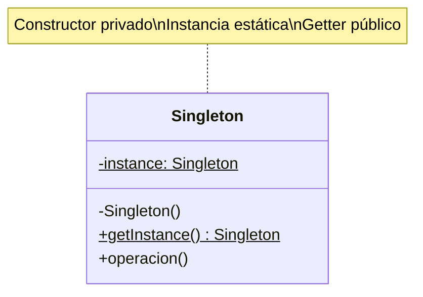

# Patrón Singleton (Instancia Única)

## 📋 Propósito

Garantiza que una clase solo tenga una instancia y proporciona un punto de acceso global a ella.

## 🎯 Problema

Algunas clases deben tener exactamente una instancia (ej: conexión a BD, configuración global, logger, pool de conexiones). Necesitas:
- Control estricto sobre cuántas instancias existen
- Punto de acceso global
- Creación lazy (cuando se necesite)

## 💡 Solución

Hacer que la clase sea responsable de mantener su única instancia, con un método estático para acceder a ella.

## 🏗️ Estructura



## 💻 Implementaciones en Java

### 1. Singleton Clásico (Lazy Initialization)

```java
public class ConfiguracionSistema {
    private static ConfiguracionSistema instancia;
    
    private String rutaArchivos;
    private String servidor;
    private int puerto;
    
    // Constructor privado
    private ConfiguracionSistema() {
        // Cargar configuración
        this.rutaArchivos = "/app/data";
        this.servidor = "localhost";
        this.puerto = 8080;
        System.out.println("⚙️  Configuración inicializada");
    }
    
    // Método estático de acceso
    public static ConfiguracionSistema getInstance() {
        if (instancia == null) {
            instancia = new ConfiguracionSistema();
        }
        return instancia;
    }
    
    public String getRutaArchivos() { return rutaArchivos; }
    public String getServidor() { return servidor; }
    public int getPuerto() { return puerto; }
}

// Uso
ConfiguracionSistema config = ConfiguracionSistema.getInstance();
System.out.println("Servidor: " + config.getServidor());

ConfiguracionSistema config2 = ConfiguracionSistema.getInstance();
System.out.println(config == config2); // true - misma instancia
```

### 2. Singleton Thread-Safe (Double-Checked Locking)

```java
public class DatabaseConnection {
    private static volatile DatabaseConnection instancia;
    
    private Connection connection;
    
    private DatabaseConnection() {
        try {
            // Conexión costosa
            Thread.sleep(1000); // Simular tiempo de conexión
            this.connection = DriverManager.getConnection("jdbc:mysql://...");
            System.out.println("🗄️  Conexión a BD establecida");
        } catch (Exception e) {
            throw new RuntimeException("Error conectando a BD", e);
        }
    }
    
    public static DatabaseConnection getInstance() {
        if (instancia == null) {
            synchronized (DatabaseConnection.class) {
                if (instancia == null) {
                    instancia = new DatabaseConnection();
                }
            }
        }
        return instancia;
    }
    
    public Connection getConnection() {
        return connection;
    }
}
```

### 3. Singleton Eager Initialization (Instanciación Temprana)

```java
public class Logger {
    // Instancia creada al cargar la clase
    private static final Logger INSTANCE = new Logger();
    
    private Logger() {
        System.out.println("📝 Logger inicializado");
    }
    
    public static Logger getInstance() {
        return INSTANCE;
    }
    
    public void log(String mensaje) {
        System.out.println("[LOG] " + LocalDateTime.now() + " - " + mensaje);
    }
    
    public void error(String mensaje) {
        System.err.println("[ERROR] " + LocalDateTime.now() + " - " + mensaje);
    }
}

// Uso
Logger.getInstance().log("Aplicación iniciada");
Logger.getInstance().error("Error de conexión");
```

### 4. Singleton con Enum (Mejor práctica en Java)

```java
public enum AppConfig {
    INSTANCE;
    
    private String ambiente;
    private Map<String, String> propiedades;
    
    AppConfig() {
        this.ambiente = "DESARROLLO";
        this.propiedades = new HashMap<>();
        propiedades.put("version", "1.0.0");
        propiedades.put("max_connections", "100");
        System.out.println("🔧 AppConfig inicializado");
    }
    
    public String getPropiedad(String clave) {
        return propiedades.get(clave);
    }
    
    public String getAmbiente() {
        return ambiente;
    }
    
    public void setAmbiente(String ambiente) {
        this.ambiente = ambiente;
    }
}

// Uso
AppConfig config = AppConfig.INSTANCE;
System.out.println("Versión: " + config.getPropiedad("version"));
System.out.println("Ambiente: " + config.getAmbiente());
```

### 5. Singleton con Bill Pugh (Inner Static Helper)

```java
public class CacheManager {
    private Map<String, Object> cache;
    
    private CacheManager() {
        this.cache = new ConcurrentHashMap<>();
        System.out.println("💾 CacheManager inicializado");
    }
    
    // Clase interna estática - no se carga hasta que se usa getInstance()
    private static class SingletonHelper {
        private static final CacheManager INSTANCE = new CacheManager();
    }
    
    public static CacheManager getInstance() {
        return SingletonHelper.INSTANCE;
    }
    
    public void put(String key, Object value) {
        cache.put(key, value);
    }
    
    public Object get(String key) {
        return cache.get(key);
    }
    
    public void limpiar() {
        cache.clear();
        System.out.println("🧹 Cache limpiado");
    }
}
```

## 🎯 Ejemplo Empresa: Connection Pool Singleton

```java
@Component
public class ConnectionPoolManager {
    private static volatile ConnectionPoolManager instancia;
    
    private HikariDataSource dataSource;
    private final int MAX_POOL_SIZE = 20;
    
    private ConnectionPoolManager() {
        initializePool();
    }
    
    public static ConnectionPoolManager getInstance() {
        if (instancia == null) {
            synchronized (ConnectionPoolManager.class) {
                if (instancia == null) {
                    instancia = new ConnectionPoolManager();
                }
            }
        }
        return instancia;
    }
    
    private void initializePool() {
        HikariConfig config = new HikariConfig();
        config.setJdbcUrl("jdbc:mysql://localhost:3306/mronline");
        config.setUsername("root");
        config.setPassword("password");
        config.setMaximumPoolSize(MAX_POOL_SIZE);
        config.setMinimumIdle(5);
        config.setConnectionTimeout(30000);
        config.setIdleTimeout(600000);
        
        this.dataSource = new HikariDataSource(config);
        
        log.info("🔗 Connection Pool inicializado con {} conexiones", MAX_POOL_SIZE);
    }
    
    public Connection getConnection() throws SQLException {
        return dataSource.getConnection();
    }
    
    public void close() {
        if (dataSource != null && !dataSource.isClosed()) {
            dataSource.close();
            log.info("🔌 Connection Pool cerrado");
        }
    }
    
    public int getActiveConnections() {
        return dataSource.getHikariPoolMXBean().getActiveConnections();
    }
}

// Uso en servicio
@Service
public class SucursalService {
    
    public List<Sucursal> obtenerSucursales() throws SQLException {
        ConnectionPoolManager pool = ConnectionPoolManager.getInstance();
        
        try (Connection conn = pool.getConnection();
             Statement stmt = conn.createStatement();
             ResultSet rs = stmt.executeQuery("SELECT * FROM sucursal")) {
            
            List<Sucursal> sucursales = new ArrayList<>();
            while (rs.next()) {
                sucursales.add(mapToSucursal(rs));
            }
            return sucursales;
        }
    }
}
```

### Ejemplo: Gestor de Sesión de Usuario

```java
public class SesionUsuario {
    private static volatile SesionUsuario instancia;
    
    private String usuarioActual;
    private String token;
    private LocalDateTime loginTime;
    private Map<String, Object> sesionData;
    
    private SesionUsuario() {
        this.sesionData = new HashMap<>();
    }
    
    public static SesionUsuario getInstance() {
        if (instancia == null) {
            synchronized (SesionUsuario.class) {
                if (instancia == null) {
                    instancia = new SesionUsuario();
                }
            }
        }
        return instancia;
    }
    
    public void iniciarSesion(String usuario, String token) {
        this.usuarioActual = usuario;
        this.token = token;
        this.loginTime = LocalDateTime.now();
        System.out.println("✅ Sesión iniciada para: " + usuario);
    }
    
    public void cerrarSesion() {
        System.out.println("👋 Cerrando sesión de: " + usuarioActual);
        this.usuarioActual = null;
        this.token = null;
        this.sesionData.clear();
    }
    
    public boolean estaAutenticado() {
        return usuarioActual != null && token != null;
    }
    
    public String getUsuarioActual() {
        return usuarioActual;
    }
    
    public void guardarEnSesion(String key, Object value) {
        sesionData.put(key, value);
    }
    
    public Object obtenerDeSesion(String key) {
        return sesionData.get(key);
    }
}

// Uso
public class LoginController {
    public void login(String usuario, String password) {
        // Validar credenciales...
        String token = generarToken();
        
        SesionUsuario sesion = SesionUsuario.getInstance();
        sesion.iniciarSesion(usuario, token);
        sesion.guardarEnSesion("ultimoAcceso", LocalDateTime.now());
    }
    
    public void logout() {
        SesionUsuario.getInstance().cerrarSesion();
    }
}
```

## 🧪 Testing con Singleton

```java
// Problema: Singleton dificulta testing
public class ServicioConSingleton {
    public void operacion() {
        ConfiguracionSistema config = ConfiguracionSistema.getInstance();
        // Difícil de mockear
    }
}

// Solución: Inyección de Dependencias
public class ServicioConDI {
    private ConfiguracionSistema config;
    
    public ServicioConDI(ConfiguracionSistema config) {
        this.config = config;
    }
    
    public void operacion() {
        // Fácil de mockear en tests
    }
}

// En Spring
@Component
public class ConfiguracionBean {
    // Spring maneja como Singleton automáticamente
}
```

## ⚠️ Anti-Patrones y Problemas

### 1. Singleton como Global Variable (Anti-patrón)

```java
// ❌ MAL: Usado como variable global
public class ConfigGlobal {
    public static ConfigGlobal instance = new ConfigGlobal();
    public String dato1;
    public String dato2;
    // Estado mutable accesible globalmente = problemas
}

// ✅ BIEN: Estado inmutable o controlado
public class ConfigInmutable {
    private static final ConfigInmutable INSTANCE = new ConfigInmutable();
    private final String dato1;
    private final String dato2;
    
    private ConfigInmutable() {
        dato1 = "valor1";
        dato2 = "valor2";
    }
}
```

### 2. Problemas con Multi-threading

```java
// ❌ MAL: No thread-safe
public class SingletonInseguro {
    private static SingletonInseguro instancia;
    
    public static SingletonInseguro getInstance() {
        if (instancia == null) {
            instancia = new SingletonInseguro(); // Puede crear múltiples
        }
        return instancia;
    }
}

// ✅ BIEN: Thread-safe
public class SingletonSeguro {
    private static volatile SingletonSeguro instancia;
    
    public static SingletonSeguro getInstance() {
        if (instancia == null) {
            synchronized (SingletonSeguro.class) {
                if (instancia == null) {
                    instancia = new SingletonSeguro();
                }
            }
        }
        return instancia;
    }
}
```

## ✅ Aplicabilidad

Usa Singleton cuando:
- Debe haber exactamente una instancia de una clase
- La instancia debe ser accesible desde un punto bien conocido
- La única instancia debe ser extensible por subclases

**Casos comunes:**
- Configuración global
- Connection pools
- Loggers
- Cache managers
- Thread pools

## ⚖️ Ventajas y Desventajas

### ✅ Ventajas
- Control estricto sobre instancias
- Lazy initialization (ahorra recursos)
- Punto de acceso global

### ❌ Desventajas
- Viola Single Responsibility Principle
- Dificulta testing (acoplamiento)
- Puede ocultar malas decisiones de diseño
- Problemas en ambientes multi-hilo si no se implementa bien

## 💡 Alternativas Modernas

### Spring Singleton Scope
```java
@Component
@Scope("singleton") // Default en Spring
public class MiServicio {
    // Spring gestiona como singleton
}
```

### Dependency Injection
```java
// Mejor que Singleton tradicional
@Configuration
public class AppConfig {
    @Bean
    public ConfiguracionSistema configuracion() {
        return new ConfiguracionSistema();
    }
}
```

## 📚 Referencias
- Gang of Four - Design Patterns
- Spring Framework Documentation

---
*Última actualización: 2026-01-07*
