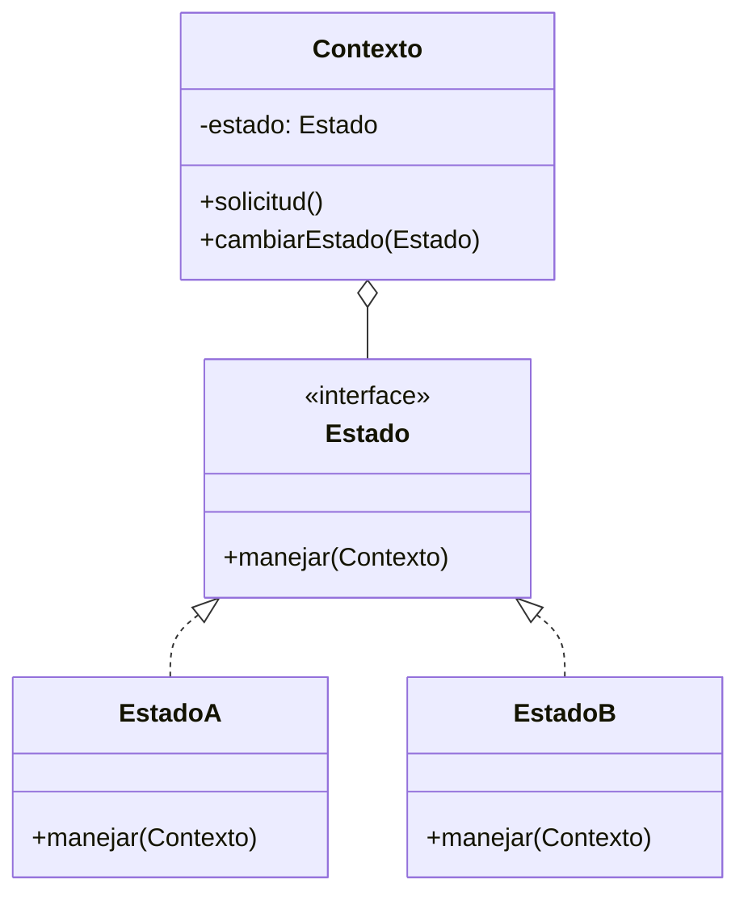

# Patrón State (Estado)

## 📋 Propósito

Permite a un objeto alterar su comportamiento cuando su estado interno cambia. El objeto parecerá cambiar de clase.

## 🎯 Problema

Cuando un objeto debe comportarse diferente según su estado actual, y:
- Tiene muchos estados posibles
- El comportamiento cambia sustancialmente entre estados
- Usar condicionales `if/switch` para cada estado hace el código difícil de mantener

## 💡 Solución

Extraer todos los comportamientos específicos de cada estado en clases Estado separadas. El objeto contexto delega el trabajo a una instancia de Estado.

## 🏗️ Estructura



## 💻 Ejemplo: Conexión TCP

```java
// Estado
public interface EstadoConexion {
    void abrir(ConexionTCP conexion);
    void cerrar(ConexionTCP conexion);
    void enviar(ConexionTCP conexion, String datos);
    String getNombre();
}

// Estados Concretos
public class EstadoCerrada implements EstadoConexion {
    @Override
    public void abrir(ConexionTCP conexion) {
        System.out.println("🔓 Abriendo conexión...");
        conexion.cambiarEstado(new EstadoEstablecida());
    }
    
    @Override
    public void cerrar(ConexionTCP conexion) {
        System.out.println("⚠️  La conexión ya está cerrada");
    }
    
    @Override
    public void enviar(ConexionTCP conexion, String datos) {
        System.out.println("❌ No se pueden enviar datos. Conexión cerrada");
    }
    
    @Override
    public String getNombre() { return "CERRADA"; }
}

public class EstadoEstablecida implements EstadoConexion {
    @Override
    public void abrir(ConexionTCP conexion) {
        System.out.println("⚠️  La conexión ya está abierta");
    }
    
    @Override
    public void cerrar(ConexionTCP conexion) {
        System.out.println("🔒 Cerrando conexión...");
        conexion.cambiarEstado(new EstadoCerrada());
    }
    
    @Override
    public void enviar(ConexionTCP conexion, String datos) {
        System.out.println("📤 Enviando datos: " + datos);
        conexion.cambiarEstado(new EstadoEscuchando());
    }
    
    @Override
    public String getNombre() { return "ESTABLECIDA"; }
}

public class EstadoEscuchando implements EstadoConexion {
    @Override
    public void abrir(ConexionTCP conexion) {
        System.out.println("⚠️  La conexión ya está abierta");
    }
    
    @Override
    public void cerrar(ConexionTCP conexion) {
        System.out.println("🔒 Cerrando conexión...");
        conexion.cambiarEstado(new EstadoCerrada());
    }
    
    @Override
    public void enviar(ConexionTCP conexion, String datos) {
        System.out.println("📤 Enviando datos: " + datos);
    }
    
    @Override
    public String getNombre() { return "ESCUCHANDO"; }
}

// Contexto
public class ConexionTCP {
    private EstadoConexion estado;
    
    public ConexionTCP() {
        this.estado = new EstadoCerrada();
    }
    
    public void cambiarEstado(EstadoConexion nuevoEstado) {
        System.out.println("🔄 Estado: " + estado.getNombre() + " → " + nuevoEstado.getNombre());
        this.estado = nuevoEstado;
    }
    
    public void abrir() {
        estado.abrir(this);
    }
    
    public void cerrar() {
        estado.cerrar(this);
    }
    
    public void enviar(String datos) {
        estado.enviar(this, datos);
    }
    
    public String getEstadoActual() {
        return estado.getNombre();
    }
}

// Uso
public class RedTCP {
    public static void main(String[] args) {
        ConexionTCP conexion = new ConexionTCP();
        System.out.println("Estado inicial: " + conexion.getEstadoActual());
        System.out.println();
        
        conexion.enviar("Hola");  // Error: conexión cerrada
        System.out.println();
        
        conexion.abrir();  // Abre conexión
        System.out.println();
        
        conexion.enviar("Datos de prueba");  // Envía correctamente
        System.out.println();
        
        conexion.cerrar();  // Cierra conexión
        System.out.println();
        
        conexion.cerrar();  // Ya está cerrada
    }
}
```

**Salida:**
```
Estado inicial: CERRADA

❌ No se pueden enviar datos. Conexión cerrada

🔓 Abriendo conexión...
🔄 Estado: CERRADA → ESTABLECIDA

📤 Enviando datos: Datos de prueba
🔄 Estado: ESTABLECIDA → ESCUCHANDO

🔒 Cerrando conexión...
🔄 Estado: ESCUCHANDO → CERRADA

⚠️  La conexión ya está cerrada
```

## 🎯 Ejemplo Empresa: Estados de Pedido

```java
// Estado
public interface EstadoPedido {
    void confirmar(Pedido pedido);
    void preparar(Pedido pedido);
    void entregar(Pedido pedido);
    void cancelar(Pedido pedido);
    String getNombre();
}

// Estados Concretos
public class EstadoPendiente implements EstadoPedido {
    @Override
    public void confirmar(Pedido pedido) {
        System.out.println("✅ Pedido confirmado");
        pedido.cambiarEstado(new EstadoConfirmado());
    }
    
    @Override
    public void preparar(Pedido pedido) {
        System.out.println("❌ Debe confirmar el pedido primero");
    }
    
    @Override
    public void entregar(Pedido pedido) {
        System.out.println("❌ Debe confirmar el pedido primero");
    }
    
    @Override
    public void cancelar(Pedido pedido) {
        System.out.println("🚫 Pedido cancelado");
        pedido.cambiarEstado(new EstadoCancelado());
    }
    
    @Override
    public String getNombre() { return "PENDIENTE"; }
}

public class EstadoConfirmado implements EstadoPedido {
    @Override
    public void confirmar(Pedido pedido) {
        System.out.println("⚠️  El pedido ya está confirmado");
    }
    
    @Override
    public void preparar(Pedido pedido) {
        System.out.println("👨‍🍳 Preparando pedido...");
        pedido.cambiarEstado(new EstadoEnPreparacion());
    }
    
    @Override
    public void entregar(Pedido pedido) {
        System.out.println("❌ Debe preparar el pedido primero");
    }
    
    @Override
    public void cancelar(Pedido pedido) {
        System.out.println("🚫 Pedido cancelado");
        pedido.cambiarEstado(new EstadoCancelado());
    }
    
    @Override
    public String getNombre() { return "CONFIRMADO"; }
}

public class EstadoEnPreparacion implements EstadoPedido {
    @Override
    public void confirmar(Pedido pedido) {
        System.out.println("⚠️  El pedido ya está en preparación");
    }
    
    @Override
    public void preparar(Pedido pedido) {
        System.out.println("⚠️  El pedido ya está en preparación");
    }
    
    @Override
    public void entregar(Pedido pedido) {
        System.out.println("🚚 Pedido listo para entrega");
        pedido.cambiarEstado(new EstadoEntregado());
    }
    
    @Override
    public void cancelar(Pedido pedido) {
        System.out.println("❌ No se puede cancelar un pedido en preparación");
    }
    
    @Override
    public String getNombre() { return "EN_PREPARACION"; }
}

public class EstadoEntregado implements EstadoPedido {
    @Override
    public void confirmar(Pedido pedido) {
        System.out.println("⚠️  El pedido ya fue entregado");
    }
    
    @Override
    public void preparar(Pedido pedido) {
        System.out.println("⚠️  El pedido ya fue entregado");
    }
    
    @Override
    public void entregar(Pedido pedido) {
        System.out.println("⚠️  El pedido ya fue entregado");
    }
    
    @Override
    public void cancelar(Pedido pedido) {
        System.out.println("❌ No se puede cancelar un pedido entregado");
    }
    
    @Override
    public String getNombre() { return "ENTREGADO"; }
}

public class EstadoCancelado implements EstadoPedido {
    @Override
    public void confirmar(Pedido pedido) {
        System.out.println("❌ El pedido está cancelado");
    }
    
    @Override
    public void preparar(Pedido pedido) {
        System.out.println("❌ El pedido está cancelado");
    }
    
    @Override
    public void entregar(Pedido pedido) {
        System.out.println("❌ El pedido está cancelado");
    }
    
    @Override
    public void cancelar(Pedido pedido) {
        System.out.println("⚠️  El pedido ya está cancelado");
    }
    
    @Override
    public String getNombre() { return "CANCELADO"; }
}

// Contexto
@Entity
public class Pedido {
    @Id
    private Long id;
    
    @Transient
    private EstadoPedido estado;
    
    @Column(name = "estado")
    private String estadoNombre;
    
    public Pedido() {
        this.estado = new EstadoPendiente();
        this.estadoNombre = estado.getNombre();
    }
    
    public void cambiarEstado(EstadoPedido nuevoEstado) {
        this.estado = nuevoEstado;
        this.estadoNombre = nuevoEstado.getNombre();
        
        // Persistir cambio en BD
        // repository.save(this);
    }
    
    public void confirmar() {
        estado.confirmar(this);
    }
    
    public void preparar() {
        estado.preparar(this);
    }
    
    public void entregar() {
        estado.entregar(this);
    }
    
    public void cancelar() {
        estado.cancelar(this);
    }
    
    public String getEstadoActual() {
        return estado.getNombre();
    }
}

// Service
@Service
public class PedidoService {
    public void procesarPedido(Long idPedido) {
        Pedido pedido = pedidoRepository.findById(idPedido).orElseThrow();
        
        // Flujo normal
        pedido.confirmar();
        pedido.preparar();
        pedido.entregar();
    }
}
```

## ✅ Aplicabilidad

Usa State cuando:
- El comportamiento de un objeto depende de su estado
- Tienes operaciones con grandes condicionales multi-rama según estado
- Estados y transiciones están bien definidos
- Quieres hacer explícitas las transiciones de estado

## ⚖️ Ventajas y Desventajas

### ✅ Ventajas
- Elimina condicionales complejos
- Principio de Responsabilidad Única
- Principio Abierto/Cerrado
- Transiciones de estado explícitas

### ❌ Desventajas
- Puede ser excesivo si solo hay pocos estados
- Aumenta número de clases

## 🔗 Patrones Relacionados
- **Strategy**: Similar en estructura, pero Strategy es intercambiable, State cambia automáticamente
- **Flyweight**: Estados pueden compartirse si son inmutables

## 📚 Referencias
- Gang of Four - Design Patterns

---
*Última actualización: 2026-01-07*
