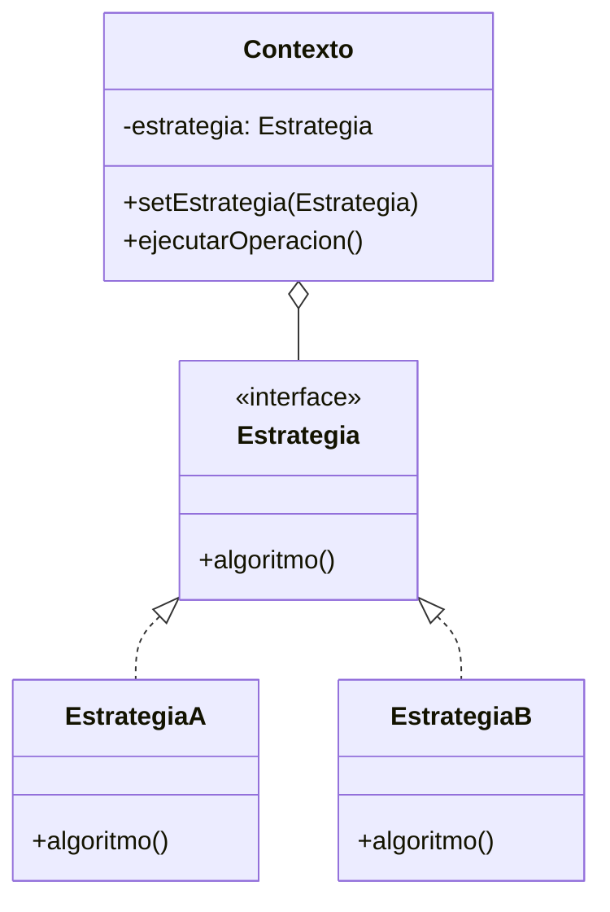

# Patrón Strategy (Estrategia)

## 📋 Propósito

Define una familia de algoritmos, encapsula cada uno y los hace intercambiables. Permite que el algoritmo varíe independientemente de los clientes que lo usan.

## 🎯 Problema

Cuando tienes diferentes formas de hacer algo (algoritmos) y quieres poder cambiarlos dinámicamente sin modificar el código cliente.

## 💡 Solución

Extraer los algoritmos en clases separadas (Estrategias) que implementan una interfaz común. El contexto usa estas estrategias intercambiablemente.

## 🏗️ Estructura



## 💻 Ejemplo: Estrategias de Descuento

```java
// Estrategia
public interface EstrategiaDescuento {
    double aplicarDescuento(double precio);
    String getDescripcion();
}

// Estrategias Concretas
public class SinDescuento implements EstrategiaDescuento {
    @Override
    public double aplicarDescuento(double precio) {
        return precio;
    }
    
    @Override
    public String getDescripcion() {
        return "Sin descuento";
    }
}

public class DescuentoPorcentaje implements EstrategiaDescuento {
    private double porcentaje;
    
    public DescuentoPorcentaje(double porcentaje) {
        this.porcentaje = porcentaje;
    }
    
    @Override
    public double aplicarDescuento(double precio) {
        return precio * (1 - porcentaje / 100);
    }
    
    @Override
    public String getDescripcion() {
        return porcentaje + "% de descuento";
    }
}

public class DescuentoFijo implements EstrategiaDescuento {
    private double monto;
    
    public DescuentoFijo(double monto) {
        this.monto = monto;
    }
    
    @Override
    public double aplicarDescuento(double precio) {
        return Math.max(0, precio - monto);
    }
    
    @Override
    public String getDescripcion() {
        return "$" + monto + " de descuento";
    }
}

// Contexto
public class Carrito {
    private List<Producto> productos = new ArrayList<>();
    private EstrategiaDescuento estrategiaDescuento;
    
    public void setEstrategiaDescuento(EstrategiaDescuento estrategia) {
        this.estrategiaDescuento = estrategia;
    }
    
    public void agregarProducto(Producto producto) {
        productos.add(producto);
    }
    
    public double calcularTotal() {
        double subtotal = productos.stream()
            .mapToDouble(Producto::getPrecio)
            .sum();
        
        double total = estrategiaDescuento != null 
            ? estrategiaDescuento.aplicarDescuento(subtotal)
            : subtotal;
        
        System.out.println("Subtotal: $" + subtotal);
        if (estrategiaDescuento != null) {
            System.out.println("Descuento: " + estrategiaDescuento.getDescripcion());
        }
        System.out.println("Total: $" + total);
        
        return total;
    }
}

// Uso
public class TiendaOnline {
    public static void main(String[] args) {
        Carrito carrito = new Carrito();
        carrito.agregarProducto(new Producto("Notebook", 1000));
        carrito.agregarProducto(new Producto("Mouse", 50));
        
        // Sin descuento
        carrito.setEstrategiaDescuento(new SinDescuento());
        carrito.calcularTotal();
        
        System.out.println();
        
        // Con descuento porcentual
        carrito.setEstrategiaDescuento(new DescuentoPorcentaje(15));
        carrito.calcularTotal();
        
        System.out.println();
        
        // Con descuento fijo
        carrito.setEstrategiaDescuento(new DescuentoFijo(200));
        carrito.calcularTotal();
    }
}
```

**Salida:**
```
Subtotal: $1050.0
Descuento: Sin descuento
Total: $1050.0

Subtotal: $1050.0
Descuento: 15.0% de descuento
Total: $892.5

Subtotal: $1050.0
Descuento: $200.0 de descuento
Total: $850.0
```

## 🎯 Ejemplo Empresa: Estrategias de Cálculo de Precio

```java
public interface CalculadorPrecio {
    double calcular(Producto producto, Cliente cliente);
}

public class PrecioNormal implements CalculadorPrecio {
    @Override
    public double calcular(Producto producto, Cliente cliente) {
        return producto.getPrecioBase();
    }
}

public class PrecioConDescuentoEmpleado implements CalculadorPrecio {
    @Override
    public double calcular(Producto producto, Cliente cliente) {
        return producto.getPrecioBase() * 0.85; // 15% descuento
    }
}

public class PrecioMayorista implements CalculadorPrecio {
    @Override
    public double calcular(Producto producto, Cliente cliente) {
        if (cliente.getCantidadCompra() >= 10) {
            return producto.getPrecioBase() * 0.75; // 25% descuento
        }
        return producto.getPrecioBase() * 0.90; // 10% descuento
    }
}

// Service
@Service
public class VentaService {
    public double calcularPrecioFinal(Producto producto, Cliente cliente) {
        CalculadorPrecio calculador;
        
        if (cliente.esEmpleado()) {
            calculador = new PrecioConDescuentoEmpleado();
        } else if (cliente.esMayorista()) {
            calculador = new PrecioMayorista();
        } else {
            calculador = new PrecioNormal();
        }
        
        return calculador.calcular(producto, cliente);
    }
}
```

## ✅ Aplicabilidad

- Tienes muchas clases relacionadas que difieren solo en su comportamiento
- Necesitas diferentes variantes de un algoritmo
- Un algoritmo usa datos que los clientes no deberían conocer
- Una clase define muchos comportamientos con condicionales múltiples

## ⚖️ Ventajas y Desventajas

### ✅ Ventajas
- Familia de algoritmos intercambiables
- Elimina condicionales complejos
- Principio Abierto/Cerrado

### ❌ Desventajas
- Aumenta número de objetos
- Clientes deben conocer diferentes estrategias

## 📚 Referencias
- Gang of Four - Design Patterns

---
*Última actualización: 2026-01-07*
